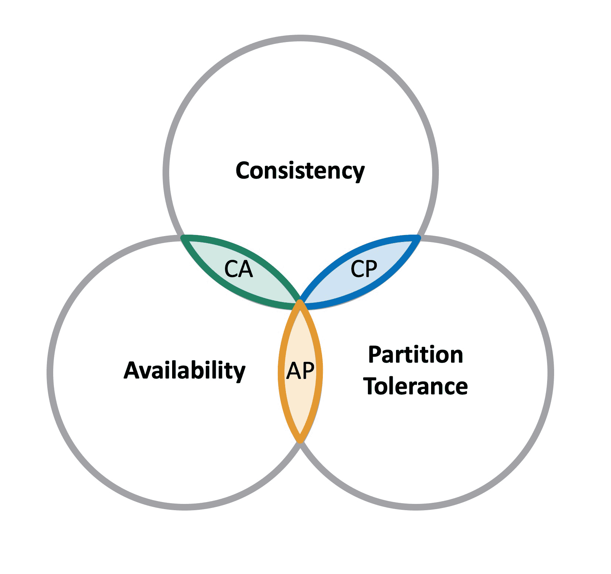

## Mapping the Modern Data Landscape: NoSQL Databases
In the early days of the internet, most systems relied on Relational Database Management Systems (RDBMS). These databases were built around tables, rows, and strict rules, and they worked very well when data was small and structured.

However, as the internet grew, everything changed. Applications started handling massive amounts of data, coming in very fast, and often in different formats. Traditional databases began to struggle with this new reality.

This shift led to the rise of NoSQL databases, which are designed to handle large-scale, flexible, and distributed data systems.

## What is NoSQL?
**NoSQL**(Not Only SQL) databases are non-relational, flexible data storage system designed for high scability, performance, and varied data structures.

### Key Characteristics:
- Schema Flexibility: No more pre-defining every column. Records can have different fields, which is perfect for evolving startups.

- Horizontal Scalability: Instead of buying a "bigger" server (Vertical), you just add "more" cheap servers (Horizontal) to the cluster.

- Distributed Design: Data is replicated across multiple nodes, ensuring that if one server fails, the system stays online.

- BASE over ACID: While SQL prizes strict accuracy (ACID), NoSQL often prizes speed and availability (BASE).

## ACID vs. BASE
### ACID (Used in Relational Databases)

- ACID ensures that every transaction is handled with full accuracy:

Atomicity: Either everything happens or nothing happens
Consistency: Data remains valid before and after operations
Isolation: Transactions don’t interfere with each other
Durability:  Once saved, data is permanent

- This is essential for systems like banking, where mistakes are unacceptable.

### BASE (Used in NoSQL Databases)

- BASE is more relaxed and focuses on performance:

Basically Available: The system always responds
Soft State: Data may not be immediately consistent
Eventually Consistent: All data will become consistent over time

- This approach is acceptable for systems where immediate accuracy is not critical.

## CAP theorem 

The CAP Theorem explains the limitations of distributed databases.

It states that a system can only provide two out of three guarantees at the same time:

#### C: Consistency
Every user sees the same data at the same time.

#### A: Availability
Every request gets a response, even if it is not the latest data.

#### P: Partition Tolerance
The system continues working even if communication between servers fails.

## Types of NoSQL Databases
Different NoSQL databases are designed for different types of data and use cases.

In real world systems, network failures are unavoidable.
So partition tolerance is always required.

This leaves a choice between:

- **CP Systems**: focus on consistency, may reduce availability
- **AP Systems**: focus on availability, may allow temporary inconsistency

### Types of NoSQL Databases
Different NoSQL databases are designed for different types of data and use cases.

1. Key-Value Stores
- It Like a giant dictionary. when we provide a Key, and get a Value.
- It is best for Caching, user sessions, shopping carts.
- Examples: Redis, Amazon DynamoDB.

2. Document Databases
- In this database the data are stores as JSON-like documents. We can nest data (like an address inside a user profile).
- It is best for Content Management (CMS), E-commerce catalogs.
- Examples: MongoDB, CouchDB.

3. Column-Family / Wide-Column
- It is Optimized for massive amounts of data across many columns.
- It is best for IoT sensor data, logging billions of events, web indexing.
- Examples: Cassandra, HBase.

4. Graph Databases (The Relationship Experts)
- It Stores "Nodes" (people/things) and "Edges" (relationships).
- It used for  Social networks, recommendation engines (e.g., "People you may know").
- Examples: Neo4j, Amazon Neptune.

5. Time-Series Databases (The Chronologers)
- It is Optimized for data measured over time.
- it is best for Stock market prices, CPU monitoring, weather data.
- Examples: InfluxDB, Prometheus.

6. Vector Databases (The AI Brain)
- It Stores data as mathematical coordinates (embeddings) to find "similar" things.
- It is best for AI/LLM memory, image similarity search, semantic search.
- Examples: Pinecone, Milvus.

### SQL vs. NoSQL Comparison Table
| Feature     | SQL             | NoSQL                     |
| ----------- | --------------- | ------------------------- |
| Structure   | Fixed tables    | Flexible formats          |
| Scaling     | Vertical        | Horizontal                |
| Consistency | Strong (ACID)   | Eventual (BASE)           |
| Use case    | Structured data | Big data & real-time apps |

### Choosing the Right Database
If we are building a system, we should ask for these three questions:
- **Data Shape:** Is it a simple list (Key-Value), a complex object (Document), or a web of connections (Graph)?

- **Query Pattern:** Will you search by ID, or do you need to do deep math across billions of rows?

- **Reliability:** Does every millisecond of data need to be 100% accurate (CP), or is being "mostly right" and "always online" better (AP)?

### Polyglot Persistence
Modern applications rarely rely on a single database.Instead, multiple databases are used for different purposes.

Example:
- SQL: Payments (accuracy is critical)
- Redis: Caching and fast access
- MongoDB: User data

This approach is known as polyglot persistence, meaning using multiple database types to solve different problems efficiently.

NoSQL is not a replacement for traditional databases.
It is simply a different approach designed for modern challenges.

- **SQL:** structured, accurate, strict
- **NoSQL:** flexible, fast, scalable

--- 