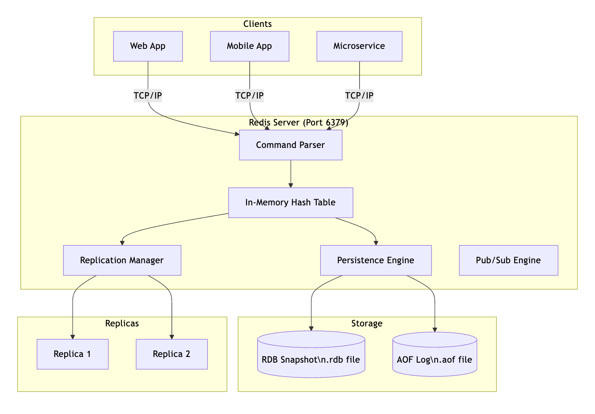
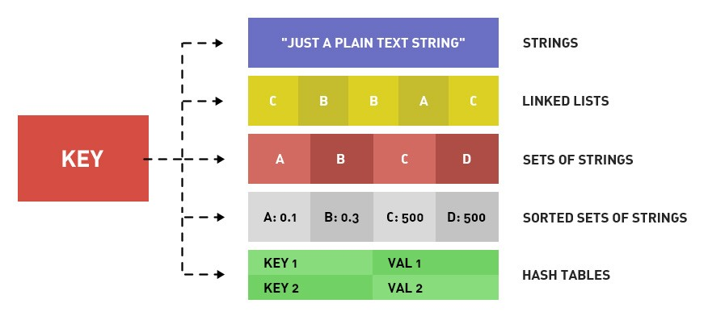
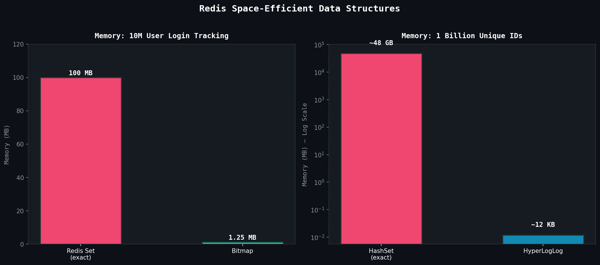

# Unit II: Key-Value Databases - Redis
**Complete Student Guide | BE Software Engineering | NoSQL Databases**

> **How to use this guide:** Every section includes prerequisite callouts, real-world examples, code blocks, and visual diagrams.

---

## Table of Contents

| # | Unit Topic |
|---|------------|
| 2.1 | [Introduction to Key-Value Databases](#21-introduction-to-key-value-databases) |
| 2.2 | [Redis Fundamentals](#22-redis-fundamentals) |
| 2.3 | [Data Structures & Algorithms](#23-redis-data-structures-and-algorithms) |
| 2.4 | [Persistence & Durability](#24-redis-persistence-and-durability) |
| 2.5 | [Clustering & High Availability](#25-redis-clustering-and-high-availability) |
| 2.6 | [Modules & Extensions](#26-redis-modules-and-extensions) |
| 2.7 | [Performance Optimization](#27-redis-performance-optimization) |
| 2.8 | [Security Considerations](#28-redis-security-considerations) |
|  | [Quick Reference Cheat Sheet](#quick-reference-cheat-sheet) |

---

## 2.1 Introduction to Key-Value Databases

### 2.1.1 Concept and Architecture

> **Prerequisite:** Recall that relational databases (MySQL, PostgreSQL) store data in structured tables with rows and columns and use SQL. Key-Value databases are fundamentally different — think of them like a giant `HashMap` or dictionary in programming.

#### What is a Key-Value Database?

A key-value database stores data as pairs of a **unique key** and its associated **value** — exactly like a `dict` in Python or a `HashMap` in Java.

**Analogy — Gym Locker System:**
> Think of a gym locker room. Each locker has a unique number (the **KEY**) and whatever you store inside is the **VALUE**. If you know the locker number, you retrieve your belongings in O(1) time — no searching through every locker.

```
KEY                          VALUE
─────────────────────────    ──────────────────────────────
user:1001:name           →   "Alice"
session:abc123           →   "{userId: 1001, role: admin}"
product:iphone15:price   →   "1299"
leaderboard              →   [sorted list of players]
```

#### Redis Architecture



Redis has 3 main layers: Client, Redis Server, and Storage & Replicas.

1. Clients (Who talks to Redis)

Three types of apps send requests to Redis:
- Web App
- Mobile App
- Microservice
All three connect using TCP/IP on port 6379 — the default Redis port.

2. Redis Server (The brain)
Every incoming request first hits the Command Parser.
Think of it as a receptionist — it reads the command (like GET key or SET key value) and figures out what to do with it.

Then the parsed command goes straight to the In-Memory Hash Table — this is where all the actual data lives, stored in RAM for lightning-fast access.

3. Three Engines (What happens after data is stored)
From the Hash Table, data flows to three systems:
EngineJobReplication ManagerCopies data to replica servers for backup/load balancingPersistence EngineSaves data to disk so it survives restartsPub/Sub EngineHandles real-time messaging between publishers and subscribers

4. Storage & Replicas (The bottom)
Replicas (left side):

Replica 1 & Replica 2:  exact copies of the main Redis data, kept in sync by the Replication Manager

Storage (right side): two ways Redis saves data to disk:

RDB Snapshot (.rdb file):  periodic full snapshots, like a photo of the data at a point in time
AOF Log (.aof file) — logs every write command, like a receipt history. More detailed but larger


**The Key Idea**

- Redis keeps everything in memory (RAM) for speed, but uses persistence + replication to make sure data isn't lost if something crashes.


#### How Redis Stores Data Internally

Redis uses a hash table internally — the same data structure as `dict` in Python. This gives **O(1) average time** for `GET` and `SET`.

> **Real-World Example — Twitter/X:**
> Twitter uses Redis to store each user's timeline. When we open the app, it doesn't run a complex SQL JOIN across 500 million tweets — it simply fetches a pre-built list stored in Redis under `timeline:user:1234`. Sub-millisecond response time for 300M+ users.

```python
# How Redis thinks of your data internally:
{
    "user:1001:name"    : "Alice",
    "user:1001:email"   : "alice@example.com",
    "product:42:stock"  : "150",
    "session:xyz789"    : '{"userId": 1001, "role": "admin"}',
    "counter:visits"    : "94827"
}
```

---

### 2.1.2 Advantages and Limitations

#### Advantages

| Advantage | Why It Matters | Example |
|-----------|---------------|---------|
| **Blazing Fast** | In-memory = no disk I/O. O(1) operations | 1,000,000+ ops/sec on one machine |
| **Simple Model** | No schemas, no JOINs, no complex queries | Store session data without defining tables |
| **Horizontally Scalable** | Redis Cluster shards across nodes | Add nodes as user base grows |
| **Flexible Types** | 10+ data types beyond strings | Sorted Sets for leaderboards |
| **Atomic Operations** | INCR is atomic — thread-safe by design | Safe concurrent counters |
| **TTL Support** | Keys auto-expire (Time To Live) | Auto-expire sessions after 30 min |
| **Pub/Sub Built-in** | Event broadcasting natively | Real-time chat notifications |

#### Limitations

| Limitation | Explanation |
|-----------|-------------|
| **Memory-Bound** | ALL data lives in RAM. RAM is expensive. You can't store 500GB in Redis. |
| **No Complex Queries** | No SQL JOIN, GROUP BY, complex WHERE. Design data around access patterns. |
| **Limited ACID** | MULTI/EXEC ≠ full SQL transactions. No rollback on runtime errors. |
| **Key-Based Lookup** | Scanning all keys is O(N) and dangerous in production. |
| **Persistence Complexity** | In-memory data risks loss without careful persistence config. |

> **Key Insight for Students:**
> Redis is **NOT** a replacement for PostgreSQL or MySQL. It's a **complement**. Use Redis as a cache, session store, queue, or leaderboard — *alongside* a persistent relational database.

---

### 2.1.3 Common Use Cases

| Use Case | How Redis Helps | Real Company |
|----------|----------------|--------------|
| **Session Management** | Store login sessions with auto-expiry TTL | GitHub, GitLab |
| **Caching** | Cache DB query results, API responses | Twitter, Instagram, Pinterest |
| **Rate Limiting** | Count API calls per user per time window | Stripe API, GitHub API |
| **Leaderboards** | Sorted Sets rank users by score in real-time | Stack Overflow, Gaming apps |
| **Real-time Analytics** | Count events, unique visitors | YouTube view counts |
| **Message Queues** | Lists as FIFO queues for task processing | Celery (Python), Sidekiq (Ruby) |
| **Pub/Sub** | Event broadcasting between microservices | Slack notifications |
| **Geolocation** | Find nearby drivers, restaurants, stores | Uber, Zomato, Swiggy |
| **Autocomplete** | Prefix-based search suggestions | Search suggestion boxes |
| **Distributed Locks** | Prevent race conditions across servers | Payment processing |

> **Real-World Example — Amazon Shopping Cart:**
> When we add an item to our Amazon cart, that data is stored in Redis as `cart:user:9876`. It persists for our session and expires after 30 days of inactivity — faster than querying a database on every page load.

---

## 2.2 Redis Fundamentals

### 2.2.1 Redis Data Model

> **Prerequisite:** A data model describes HOW data is organized and accessed. In Redis, the model is a **flat key-value namespace** with rich value types — no tables, no rows, no foreign keys.

#### Key Naming Conventions

Since all keys share the same namespace, structured naming is critical:

```
Pattern: object-type:id:attribute

Examples:
user:1001:profile          # User profile data
user:1001:sessions         # User's active sessions
product:sku:BTN500:details # Product details
order:ORD2024001:status    # Order status
cache:homepage:trending    # Cached content
ratelimit:user:1001:api    # Rate limiting counter
```

> **Tip:** Use colons (`:`) as separators consistently. This lets you use `SCAN 0 MATCH user:*` to find all user-related keys safely in production.

#### Key Rules

| Rule | Detail |
|------|--------|
| **Format** | Binary-safe strings (use readable UTF-8 names) |
| **Max Size** | 512 MB (keep them short — they add to memory) |
| **Case Sensitive** | `User:1001` ≠ `user:1001` |
| **TTL** | Keys can auto-expire in seconds or milliseconds |

---

### 2.2.2 Redis Data Types

> **The Big Picture:** This is what makes Redis special. Unlike simple KV stores, Redis supports multiple rich value types.



---

#### 1. Strings

The most fundamental type. Binary-safe. Can hold text, numbers, serialized JSON, even images. **Max: 512 MB.**

```redis
SET username "Alice"
SET counter 0
SET user:1001:profile '{"name":"Alice","age":25}'   # Store JSON as string
SET flag 1

GET username                    # Returns "Alice"
GET counter                     # Returns "0"
INCR counter                    # counter → 1 (ATOMIC increment)
INCRBY counter 5                # counter → 6
DECR counter                    # counter → 5
INCRBYFLOAT price 1.5           # Float increment

# Key with expiry (TTL):
SETEX session:tok123 3600 "user:1001"   # Expires in 3600 seconds
TTL session:tok123              # Returns remaining seconds
PTTL session:tok123             # Returns remaining milliseconds
EXPIRE username 86400           # Set expiry on existing key
PERSIST username                # Remove expiry (make permanent)
```

> **Real-World Example — Rate Limiting (Twitter):**
> Twitter limits 300 tweets per 3 hours. Implementation:

```redis
SET ratelimit:user:1001:tweets 0
INCR ratelimit:user:1001:tweets   # On each tweet
EXPIRE ratelimit:user:1001:tweets 10800   # 3 hours
# When value hits 300 → reject the request
```

---

#### 2. Lists

An ordered list of strings, implemented as a **doubly linked list**. Supports push/pop from both ends — perfect for queues and stacks.

```
Left End (Head)                          Right End (Tail)
      ▼                                        ▼
LPUSH/LPOP  [resize_image] [send_email] [gen_pdf]  RPUSH/RPOP

← QUEUE  (LPUSH + RPOP) →
←← STACK (LPUSH + LPOP) →
```

```redis
LPUSH tasks "send_email"          # Push to LEFT: ["send_email"]
LPUSH tasks "resize_image"        # ["resize_image", "send_email"]
RPUSH tasks "generate_pdf"        # ["resize_image", "send_email", "generate_pdf"]
LLEN tasks                        # Returns 3
LRANGE tasks 0 -1                 # Get ALL elements (0=first, -1=last)
LRANGE tasks 0 1                  # Get first 2 elements
LINDEX tasks 0                    # Get element at index 0
LPOP tasks                        # Remove & return "resize_image" (from left)
RPOP tasks                        # Remove & return "generate_pdf" (from right)

# Blocking pop — WAITS for a new task (perfect for workers!)
BLPOP tasks 30                    # Block up to 30 seconds waiting for a task
```

> **Real-World Example — Celery Task Queue (Instagram):**
> When a user uploads a photo on Instagram, a job is pushed to a Redis list: `RPUSH jobs:image:resize "{photoId: 9876}"`. Background worker processes (using `BLPOP`) pick up and process jobs — resizing images, sending notifications — without polling.

---

#### 3. Sets

An **unordered collection of unique strings**. Duplicates are automatically ignored. Supports powerful math operations.

```redis
SADD followers:user:1001 "user:2001" "user:3001" "user:4001"
SADD following:user:2001 "user:1001" "user:5001"

SMEMBERS followers:user:1001              # Get all members
SISMEMBER followers:user:1001 "user:2001" # Returns 1 (is member)
SCARD followers:user:1001                 # Count = 3
SPOP followers:user:1001                  # Remove & return a random member

# ─── Set Math Operations ───
SADD tags:article:101 "redis" "nosql" "database"
SADD tags:article:102 "redis" "caching" "performance"

SINTER tags:article:101 tags:article:102  # Intersection → {"redis"}
SUNION tags:article:101 tags:article:102  # Union → all unique tags
SDIFF  tags:article:101 tags:article:102  # Difference → {"nosql","database"}
```

> **Real-World Example — LinkedIn "People You May Know":**
> ```redis
> SINTER connections:alice connections:bob
> # Returns users known by BOTH → potential connection suggestions
> ```

---

#### 4. Hashes

A **field-value map** stored under a single key. Think: a mini-dictionary, or a single database row. Perfect for representing objects.

**Hash vs String — Which to use for objects?**

| Approach | Code | Problem |
|----------|------|---------|
| **String** | `SET user:1001 '{"name":"Alice","age":28}'` | To update age, must read → deserialize → update → serialize → write entire object |
| **Hash** | `HSET user:1001 name "Alice" age 28` | Update just one field: `HSET user:1001 age 29` — no touching other fields |

```redis
# Store a user object as a Hash
HSET user:1001 name "Alice Sharma" email "alice@example.com" age 28 city "Thimphu"

HGET user:1001 name             # Returns "Alice Sharma"
HGET user:1001 email            # Returns "alice@example.com"
HGETALL user:1001               # Returns ALL fields and values
HMGET user:1001 name email      # Get multiple specific fields
HKEYS user:1001                 # Returns field names: [name, email, age, city]
HVALS user:1001                 # Returns values only
HLEN user:1001                  # Returns 4 (number of fields)
HSET user:1001 name "Alice S."  # Update just one field
HDEL user:1001 city             # Delete one field
HEXISTS user:1001 email         # Does field exist? → 1
HINCRBY user:1001 age 1         # Atomically increment age field
```

> **Real-World Example — GitHub Repositories:**
> ```redis
> HSET repo:torvalds/linux stars 170000 forks 49000 language "C"
> ```
> When you open the repo page, GitHub fetches all fields with `HGETALL` in microseconds — no SQL query.

---

#### 5. Sorted Sets (ZSets)

The **most powerful Redis type**. Like a Set, but every member has a floating-point **score**. Members are always kept sorted by score. Time complexity: **O(log N)** for most operations.

```redis
# ─── Game Leaderboard ───
ZADD leaderboard 9500 "player:alice"
ZADD leaderboard 8200 "player:bob"
ZADD leaderboard 9800 "player:charlie"
ZADD leaderboard 7100 "player:diana"

# Get top 3 (highest scores first):
ZREVRANGE leaderboard 0 2 WITHSCORES
# → charlie 9800 | alice 9500 | bob 8200

# Get rank (0-indexed, best = rank 0):
ZREVRANK leaderboard "player:alice"         # → 1 (2nd place)
ZSCORE leaderboard "player:alice"           # → 9500.0

# Add points:
ZINCRBY leaderboard 500 "player:alice"      # alice → 10000

# Range by score:
ZRANGEBYSCORE leaderboard 8000 10000 WITHSCORES  # All between 8000-10000
ZCOUNT leaderboard 8000 +inf                # Count with score >= 8000

# Remove lowest scorer:
ZPOPMIN leaderboard                         # Removes & returns diana (lowest score)
```

```
LEADERBOARD (sorted by score, desc):
┌────────────────────────────┐
│ 🥇 charlie      │  9800   │
│ 🥈 alice        │  9500   │
│ 🥉 bob          │  8200   │
│    diana        │  7100   │
└────────────────────────────┘
ZREVRANGE leaderboard 0 -1 WITHSCORES
```

> **Real-World Example — Stack Overflow:**
> `ZREVRANGE reputations 0 99 WITHSCORES` — fetches the top 100 users for the "Top Users" page in real-time. No complex SQL, no sorting at query time.

---

### 2.2.3 Basic Redis Commands and Operations

#### Global Key Commands (work on ALL types)

```redis
EXISTS user:1001          # Does key exist? → 1 or 0
DEL user:1001             # Delete key
TYPE user:1001            # Returns: string | list | set | hash | zset
RENAME user:1001 user:old:1001
EXPIRE user:1001 3600     # Set TTL (seconds from now)
EXPIREAT user:1001 1735689600  # TTL = Unix timestamp
PEXPIRE user:1001 60000   # TTL in milliseconds
TTL user:1001             # Remaining TTL in seconds (-1 = no TTL, -2 = key gone)
PERSIST user:1001         # Remove TTL

# ─── Searching Keys ───
KEYS user:*               # DANGEROUS in production!
SCAN 0 MATCH user:* COUNT 100  # Safe cursor-based iteration
```

>  **WARNING — Never `KEYS *` in Production!**
> `KEYS` is O(N) and **blocks ALL other operations** while scanning. Use `SCAN` instead — it iterates in small batches without blocking. This is a common mistake that can bring down production Redis.

#### Server Commands

```redis
PING               # Test connection → PONG
INFO               # Full server stats
INFO memory        # Memory-specific stats
INFO replication   # Replication status
DBSIZE             # Count total keys
CONFIG GET maxmemory       # Read config value
CONFIG SET maxmemory 2gb   # Update config live (no restart!)
SLOWLOG GET 10             # Last 10 slow commands
FLUSHDB                    # Delete ALL keys in current DB
FLUSHALL                   # Delete ALL keys in ALL DBs
```

---

## 2.3 Redis Data Structures and Algorithms

Beyond basic types, Redis provides specialized structures for specific problems. All are extremely memory-efficient.

### 2.3.1 Bitmaps and Bitfields

> **Prerequisite:** 1 byte = 8 bits. A bit = 0 or 1. Bitmaps treat a Redis String as an array of bits — enabling space-efficient boolean operations at massive scale.

#### Bitmaps

```redis
# ─── Daily User Login Tracking ───
# Bit position = User ID
SETBIT logins:2024-01-15 1001 1     # User 1001 logged in today
SETBIT logins:2024-01-15 2005 1     # User 2005 also logged in
SETBIT logins:2024-01-15 3099 1

GETBIT logins:2024-01-15 1001       # → 1 (logged in)
GETBIT logins:2024-01-15 9999       # → 0 (did NOT log in)
BITCOUNT logins:2024-01-15          # Total logins today

# Who was active on BOTH Jan 15 and Jan 16?
BITOP AND active_both logins:2024-01-15 logins:2024-01-16
BITCOUNT active_both                # Users active on both days
```



**Why Bitmaps are a Game-Changer:**

| Method | Memory for 10M users | Approach |
|--------|---------------------|----------|
| Redis Set (exact) | ~100 MB | Store each user ID as string |
| **Bitmap** | **~1.25 MB** | 1 bit per user |
| **Savings** | **80x smaller** | |

#### Bitfields

Store integers of custom bit-widths in a compact binary format:

```redis
# Compact game player stats:
# Offset 0:  level (u8,  0-255)
# Offset 8:  health (u8, 0-255)
# Offset 16: gold (u16, 0-65535)

BITFIELD player:1001 SET u8  0  15    # Level  = 15
BITFIELD player:1001 SET u8  8  87    # Health = 87
BITFIELD player:1001 SET u16 16 5000  # Gold   = 5000

BITFIELD player:1001 GET u8 0         # → 15
BITFIELD player:1001 INCRBY u8 0 1    # Level up! → 16

# Overflow protection: SAT = saturate at max (no wrap-around)
BITFIELD player:1001 OVERFLOW SAT INCRBY u8 8 200  # Health stays at 255
```

> **Real-World Example — GitHub Contribution Graph:**
> Those green squares on GitHub profiles? Each bit represents one day. `BITCOUNT contributions:user:torvalds` = total active days. Storing 365 days of activity for 100M users = **~4.5 GB** with bitmaps (vs ~365 GB with a Set per user).

---

### 2.3.2 HyperLogLog for Cardinality Estimation

> **Prerequisite:** Cardinality = count of **UNIQUE** elements. Counting exact unique visitors requires storing every visitor ID → O(N) memory. HyperLogLog (HLL) **estimates** this using fixed memory (~12 KB), regardless of how many items we've seen.

**The Magic Numbers:**
```
HyperLogLog:
  Memory:   Always ~12 KB (even for 1 BILLION unique items!)
  Accuracy: ~99.19% (0.81% standard error)
  Trade-off: Approximate, not exact
```

| Approach | Memory (1B unique IDs) | Accuracy |
|----------|----------------------|----------|
| HashSet (exact) | ~48 GB | 100% exact |
| Redis Set (exact) | ~48 GB | 100% exact |
| **HyperLogLog** | **~12 KB** | **~99.2%** |

```redis
# ─── Count Unique Visitors to a Webpage ───
PFADD pageviews:homepage "192.168.1.1"    # Visitor 1
PFADD pageviews:homepage "10.0.0.25"      # Visitor 2
PFADD pageviews:homepage "192.168.1.1"    # Visitor 1 AGAIN → ignored!
PFADD pageviews:homepage "172.16.5.99"    # Visitor 3

PFCOUNT pageviews:homepage                # → ~3 (estimated unique)

# ─── Merge multiple HLLs ───
PFADD pageviews:about    "user_a" "user_b" "user_c"
PFADD pageviews:products "user_b" "user_d" "user_e"

PFMERGE pageviews:combined pageviews:about pageviews:products
PFCOUNT pageviews:combined    # → ~5 (a, b, c, d, e — de-duplicated)
```

> **Real-World Example — YouTube:**
> Tracking "500 million unique views" exactly would require enormous memory. YouTube uses HLL-like structures. The view count is an approximation — and at that scale, nobody notices or cares about ±0.81% error.

---

### 2.3.3 Bloom Filters for Membership Testing

> **Prerequisite:** A Bloom Filter answers: "Have I seen this item before?"
> - Returns **"DEFINITELY NOT"** → 100% correct *(no false negatives)*
> - Returns **"PROBABLY YES"** → might be wrong *(false positives possible)*

```redis
# Create Bloom Filter: 10M URLs capacity, 0.1% false positive rate
BF.RESERVE crawled_urls 0.001 10000000

BF.ADD crawled_urls "https://example.com/page1"
BF.ADD crawled_urls "https://google.com"
BF.ADD crawled_urls "https://reddit.com/r/programming"

BF.EXISTS crawled_urls "https://example.com/page1"   # → 1 (probably seen)
BF.EXISTS crawled_urls "https://newsite.xyz/unknown"  # → 0 (DEFINITELY NOT seen)

# Bulk operations:
BF.MADD   crawled_urls "https://a.com" "https://b.com" "https://c.com"
BF.MEXISTS crawled_urls "https://a.com" "https://nope.com"   # → [1, 0]
```

> **Real-World Example — Medium.com:**
> Medium uses Bloom Filters to track which articles a user has already read — so they don't show the same article twice in the feed. Storing "read" status for 100M articles × 100M users with a HashSet = petabytes. With Bloom Filters = feasible.

---

### 2.3.4 Geospatial Indexes

Stores latitude/longitude coordinates and enables proximity queries. Internally uses Sorted Sets with **Geohash-encoded scores**.

```redis
# ─── Ride-Hailing App: Track Drivers ───
GEOADD drivers 89.6419 27.4712 "driver:D001"   # Thimphu, Bhutan
GEOADD drivers 91.1006 26.1445 "driver:D002"   # Guwahati, India
GEOADD drivers 88.3639 22.5726 "driver:D003"   # Kolkata, India

# Get a driver's position:
GEOPOS drivers "driver:D001"
# → [89.64190..., 27.47120...]

# Distance between two drivers:
GEODIST drivers "driver:D001" "driver:D002" km
# → ~400 km

# ─── Find nearest 5 drivers within 50km of customer ───
GEOSEARCH drivers
  FROMLONLAT 89.6419 27.4712   # Customer's location
  BYRADIUS 50 km
  ASC                          # Sort nearest first
  COUNT 5
  WITHCOORD WITHDIST           # Include distance and coords
```

| Command | Description |
|---------|-------------|
| `GEOADD key lon lat member` | Add a location |
| `GEOPOS key member` | Get coordinates |
| `GEODIST key m1 m2 unit` | Distance (m, km, mi, ft) |
| `GEOSEARCH key FROMLONLAT ...` | Radius/bounding box search (Redis 6.2+) |
| `GEOHASH key member` | Get Geohash string encoding |

> **Real-World Example — Swiggy / Zomato:**
> When you open the app, it runs:
> `GEOSEARCH restaurants FROMLONLAT <your_lat> <your_lon> BYRADIUS 5 km ASC`
> Returns all restaurants within 5km, sorted by proximity, in sub-millisecond time.

---

## 2.4 Redis Persistence and Durability

> **Prerequisite:** Redis is in-memory. A crash or restart clears all data — like RAM being wiped on shutdown. Persistence mechanisms save data to disk for recovery.


```
                    Persistence Options
                          │
          ┌───────────────┴───────────────┐
     No Persistence                    Add RDB
     Pure cache                           │
     Data lost on restart         ┌───────┴───────┐
                               RDB Only        Add AOF
                           Point-in-time      RDB + AOF
                            snapshots      ← RECOMMENDED
                           Fast restart,    Best of both
                            some loss
                                        AOF Only
                                     Log every write
                                    Min data loss,
                                    slower restart
```

### 2.4.1 RDB Snapshots (Redis Database Backup)

Creates binary **point-in-time snapshots** at configured intervals. Uses OS fork + Copy-On-Write to snapshot without blocking.

| Feature | Detail |
|---------|--------|
| **File format** | Compact binary `.rdb` (highly compressible) |
| **Performance impact** | Low — fork is nearly instant |
| **Recovery time** | Fast — loads single binary file |
| **Data loss risk** | Up to X minutes (last save interval) |
| **Best for** | Backups, disaster recovery, warm cache restarts |

```redis
# redis.conf:
save 900 1      # Snapshot if ≥1 key changed in 15 min
save 300 10     # Snapshot if ≥10 keys changed in 5 min
save 60 10000   # Snapshot if ≥10000 keys changed in 1 min

dbfilename dump.rdb
dir /var/lib/redis/

# Manual snapshot commands:
BGSAVE           # Background save (non-blocking )
SAVE             # Synchronous save (BLOCKS Redis — use carefully)
LASTSAVE         # Unix timestamp of last successful save
```

---

### 2.4.2 AOF (Append-Only File) Logs

Logs **every write operation** to a file. On restart, Redis replays all commands to rebuild the dataset. Like a transaction log in RDBMS.

```redis
# redis.conf:
appendonly yes
appendfilename "appendonly.aof"

# Fsync policy (when to sync buffer to disk):
appendfsync always    # Every write → MOST DURABLE, ~1000 writes/sec
appendfsync everysec  # Every second → BALANCED (recommended )
appendfsync no        # Let OS decide → FASTEST, least durable

# Auto-rewrite (compress AOF when it gets too large):
auto-aof-rewrite-percentage 100   # Rewrite when size doubles
auto-aof-rewrite-min-size 64mb    # But only if ≥64MB

# Trigger manually:
BGREWRITEAOF
```

**What the AOF file looks like (human-readable RESP format):**

```
*3           ← Command has 3 arguments
$3           ← Next arg: 3 bytes
SET          ← Command
$8           ← Next arg: 8 bytes
username     ← Key
$5           ← Next arg: 5 bytes
Alice        ← Value
```

---

### 2.4.3 Hybrid Persistence Strategies

| Strategy | Data Loss Risk | Restart Speed | Use Case |
|----------|--------------|--------------|----------|
| **No persistence** | Total loss | Instant | Pure cache, data rebuildable |
| **RDB only** | Up to minutes | Fast | Tolerable loss, backups |
| **AOF only** | ≤1 second | Slower | High-durability requirement |
| **RDB + AOF** | ≤1 second | Fast (uses RDB) | **Production recommended** |

```redis
# redis.conf — Production Hybrid Setup:
appendonly yes
appendfsync everysec
auto-aof-rewrite-percentage 100
auto-aof-rewrite-min-size 64mb

save 900 1
save 300 10
save 60 10000

# Redis 7.0+ RDB-AOF Hybrid (AOF starts with embedded RDB snapshot):
aof-use-rdb-preamble yes    # Faster rewrites + fast restart
```

> **Real-World Example — Shopify on Black Friday:**
> Shopify runs Redis in hybrid mode. AOF `everysec` ensures cart and session data loses at most 1 second during outages. Daily RDB snapshots are sent to AWS S3 for disaster recovery. During peak traffic (millions of transactions/minute), this balance is critical.

---

## 2.5 Redis Clustering and High Availability

> **Prerequisite:**
> - **Single Point of Failure (SPOF):** If one server fails, the whole service goes down.
> - **High Availability (HA):** System keeps working even if some nodes fail.
> - **Horizontal Scaling:** Adding more machines (not bigger machines).

### 2.5.1 Redis Sentinel for Automatic Failover

Sentinel monitors Redis servers and automatically promotes a replica to primary if the primary fails.

```
         Normal Operation
         ─────────────────
Primary (Writes + Reads)
    ↓ async replication
Replica 1 ←──────────────── Sentinel 1
Replica 2 ←──────────────── Sentinel 2
                             Sentinel 3

         Failover Process
         ─────────────────
1. Primary stops responding
2. Sentinels detect it
3. Quorum reached (2/3 agree → "Primary looks down!")
4. SLAVEOF NO ONE (Replica 1 promoted!)
5. App notified: new primary = Replica 1
6. App reconnects to new primary
```

```redis
# sentinel.conf:
sentinel monitor mymaster 192.168.1.100 6379 2
# Name: mymaster | Address | Quorum: 2 sentinels must agree

sentinel down-after-milliseconds mymaster 5000     # Down after 5s
sentinel failover-timeout mymaster 60000           # Failover must finish in 60s
sentinel parallel-syncs mymaster 1                 # Replicas syncing simultaneously

# Start:
redis-sentinel /etc/redis/sentinel.conf
```

> **Sentinel vs Cluster:** Sentinel solves High Availability (auto-failover) but **NOT** horizontal scaling. To scale writes beyond one machine, use Redis Cluster.

---

### 2.5.2 Redis Cluster for Horizontal Scaling

Redis Cluster automatically **shards data** across multiple nodes using hash slots.

#### Hash Slot Sharding

```
              16,384 Hash Slots
                     │
    ┌────────────────┼────────────────┐
    ▼                ▼                ▼
🖥 Node A        🖥 Node B        🖥 Node C
Slots 0–5460   Slots 5461–10922  Slots 10923–16383

key: 'user:1001'    → CRC16 % 16384 = 7638  → Node B
key: 'session:abc'  → CRC16 % 16384 = 2891  → Node A
key: 'product:55'   → CRC16 % 16384 = 12001 → Node C
```

```redis
# Hash slot formula:
slot = CRC16(key) % 16384

# ─── Force keys to same slot (Hash Tags) ───
{user:1001}.name     # Both hashed on "user:1001" → same slot
{user:1001}.email    # → same node → multi-key ops work!

# redis.conf for each cluster node:
cluster-enabled yes
cluster-config-file nodes.conf
cluster-node-timeout 5000

# Create cluster (3 masters + 3 replicas):
redis-cli --cluster create \
  192.168.1.101:6379 192.168.1.102:6379 192.168.1.103:6379 \
  192.168.1.104:6379 192.168.1.105:6379 192.168.1.106:6379 \
  --cluster-replicas 1

redis-cli -c cluster info    # Status
redis-cli -c cluster nodes   # Node details
```

#### Sentinel vs Cluster Comparison

| Feature | Redis Sentinel | Redis Cluster |
|---------|--------------|--------------|
| **Primary purpose** | HA (auto-failover) | Scaling + HA |
| **Max data** | One machine's RAM | Sum of all nodes' RAM |
| **Write throughput** | Single machine | Scales with nodes |
| **Multi-key ops** | Full support | Keys must share slot |
| **Minimum nodes** | 3 (1P + 2 Sentinels) | 6 (3M + 3R) |
| **Complexity** | Moderate | Higher |

> **Real-World Example — Instagram:**
> Instagram uses Redis Cluster across thousands of nodes to store follower/following relationships and feed data for 1+ billion users. No single machine could hold all this in RAM.

---

### 2.5.3 Replication and Data Synchronization

```redis
# On replica node's redis.conf:
replicaof 192.168.1.100 6379     # Point to primary

# Or dynamically:
REPLICAOF 192.168.1.100 6379
REPLICAOF NO ONE                  # Detach (promote to standalone)

# Check replication status on primary:
INFO replication
# → role:master
# → connected_slaves:2
# → slave0:ip=192.168.1.101,port=6379,state=online,offset=...,lag=0
```

**Full Sync Process:**
```
Replica → PSYNC ? -1 (full sync request) → Primary
Primary → BGSAVE (fork + create RDB)
Primary → Send RDB file → Replica
Replica → Load RDB (clear memory first)
Primary → Send buffered commands (accumulated during RDB transfer)
Primary → Stream every write command (ongoing replication)
```

---

## 2.6 Redis Modules and Extensions

Redis Modules (since Redis 4.0) extend Redis with new data types and commands. **Redis Stack** bundles the most popular ones together.

```
                    Redis Stack
                        │
         ┌──────────────┼──────────────┐
         │              │              │
    RediSearch      RedisJSON    RedisTimeSeries
  Full-Text Search  Native JSON    Time-Series
  + Aggregations  Storage+Query  Data+Analytics
         │              │              │
    RedisAI         RedisBloom    Redis Core
  ML Model Serving  Bloom+Cuckoo
                   Filters+HLL
```

---

### 2.6.1 RediSearch — Full-Text Search

#### A. The Index Creation: `FT.CREATE`

```redis
FT.CREATE idx:products
  ON HASH
  PREFIX 1 product:
  SCHEMA
    name        TEXT WEIGHT 5.0   # Higher weight = more relevant in search
    description TEXT
    price       NUMERIC SORTABLE
    category    TAG
    brand       TAG SORTABLE
```

**Command Breakdown:**
- `idx:products` — Identifier for the search index
- `ON HASH` — Tracks Redis Hashes (field-value pairs)
- `PREFIX 1 product:` — Only indexes keys starting with `product:`
- `SCHEMA` — Declares which fields are searchable

**Field Types:**

| Field Type | Description | Use Case |
|-----------|-------------|----------|
| `TEXT` | Full-text search with tokenization and stemming | Names and Descriptions |
| `TAG` | Atomic literal, memory-efficient, no word splitting | Categories, Brands, IDs |
| `NUMERIC` | Range-based math queries (`x > 100`) | Prices, timestamps, quantities |

**Special Modifiers:**
- `WEIGHT <value>` — Assigns importance (e.g., `5.0` on name ranks name matches higher)
- `SORTABLE` — Keeps metadata in memory for `SORTBY` clauses

#### B. Data Ingestion: `HSET`

```redis
HSET product:1001 name "iPhone 15 Pro" description "Apple flagship" price 1299 category "smartphone" brand "Apple"
HSET product:1002 name "Samsung Galaxy S24" description "Android flagship" price 999 category "smartphone" brand "Samsung"
HSET product:1003 name "Sony WH-1000XM5" description "Noise cancelling" price 350 category "headphones" brand "Sony"
```

> The engine automatically detects when a new key matching `product:` is created and adds it to the index in the background.

#### C. Querying: `FT.SEARCH`

```redis
FT.SEARCH idx:products "iPhone"                          # Full-text search
FT.SEARCH idx:products "@category:{smartphone}"          # Tag filter
FT.SEARCH idx:products "@price:[200 500]"                # Numeric range
FT.SEARCH idx:products "flagship @price:[1000 +inf]"     # Combined
FT.SEARCH idx:products "*" SORTBY price ASC              # Sort by price
FT.SEARCH idx:products "iPhone" LIMIT 0 10               # Pagination

# ─── Aggregations ───
FT.AGGREGATE idx:products "*"
  GROUPBY 1 @category
  REDUCE COUNT 0 AS product_count
```

**Query Pattern Reference:**
- `@category:{smartphone}` — `@field` + `{}` for TAG fields
- `@price:[200 500]` — Inclusive numeric range
- `+inf` — Represents infinity in numeric ranges
- `LIMIT 0 10` — Like SQL `OFFSET 0 LIMIT 10`

#### D. Key Takeaways

1. **Decoupling** — Index is separate from data. Deleting the index leaves Hash data intact.
2. **Performance** — Uses Inverted Index → O(1) or O(log N) vs O(N) for full scans.
3. **Real-time** — Index updates immediately on `HSET` or `DEL` on matching prefix.

> **Real-World Example — E-Commerce Search:**
> When you search "iPhone 15 case black" on an e-commerce site, RediSearch returns ranked results in under **10ms**, combining full-text matching with faceted filtering (brand, price range, category).

---

### 2.6.2 RedisJSON — Native JSON Storage

**RedisJSON vs String JSON:**

| Operation | Store as String | RedisJSON |
|-----------|----------------|-----------|
| **Partial update** | Read → parse → update → write | `JSON.SET $.field value` |
| **Partial read** | Get entire blob | `JSON.GET $.field` |
| **Array push** | Full rewrite | `JSON.ARRAPPEND` |
| **Search** | Not indexable | Index with RediSearch |

```redis
# ─── Store a JSON document ───
JSON.SET user:1001 $ '{
  "name": "Alice Sharma",
  "age": 28,
  "address": {"city": "Thimphu", "country": "Bhutan"},
  "skills": ["Python", "Redis", "Docker"]
}'

# ─── Read (JSONPath syntax) ───
JSON.GET user:1001 $               # Entire document
JSON.GET user:1001 $.name          # → "Alice Sharma"
JSON.GET user:1001 $.address.city  # → "Thimphu"
JSON.GET user:1001 $.skills        # → ["Python", "Redis", "Docker"]

# ─── Partial Updates (NO need to read whole doc!) ───
JSON.SET user:1001 $.age 29
JSON.SET user:1001 $.address.city "Paro"

# ─── Array Operations ───
JSON.ARRAPPEND user:1001 $.skills '"Kubernetes"'
JSON.ARRLEN    user:1001 $.skills      # → 4
JSON.ARRINDEX  user:1001 $.skills '"Redis"'   # → 1

# ─── Numeric Operations ───
JSON.NUMINCRBY user:1001 $.age 1      # age → 30
```

---

### 2.6.3 RedisTimeSeries — Time-Series Data

```redis
# ─── Create a time series ───
TS.CREATE temperature:sensor:001
  RETENTION 86400000          # Keep 24 hours (milliseconds)
  LABELS location Thimphu unit celsius

# ─── Add data points ───
TS.ADD temperature:sensor:001 * 22.5    # * = auto current timestamp
TS.ADD temperature:sensor:001 * 23.1
TS.ADD temperature:sensor:001 * 21.8

# ─── Bulk add across multiple series ───
TS.MADD
  temperature:sensor:001 * 23.5
  humidity:sensor:001    * 68.2
  pressure:sensor:001    * 1013.1

# ─── Query ───
TS.RANGE temperature:sensor:001 - +    # All data
TS.RANGE temperature:sensor:001 - + AGGREGATION avg 3600000   # Hourly avg

# ─── Automatic Downsampling Rule ───
TS.CREATERULE temperature:sensor:001 temp:hourly:001
  AGGREGATION avg 3600000     # Auto-compute hourly averages
```

> **Real-World Example — Tesla Telemetry:**
> Every Tesla sends battery level, temperature, speed, and GPS every second. RedisTimeSeries stores this with automatic aggregation (per-minute averages), enabling dashboards and anomaly detection in real-time.

---

### 2.6.4 RedisAI — ML Model Serving

```redis
# ─── Load a trained TensorFlow model ───
AI.MODELSTORE sentiment:model TF CPU
  INPUTS input_text
  OUTPUTS prediction
  BLOB <model_binary_data>

# ─── Set input tensor ───
AI.TENSORSET input:review FLOAT 1 128 VALUES 0.1 0.5 0.3 ...

# ─── Run inference ───
AI.MODELEXECUTE sentiment:model
  INPUTS 1 input:review
  OUTPUTS 1 output:sentiment

# ─── Get result ───
AI.TENSORGET output:sentiment VALUES
# → [0.92]  (92% positive sentiment)
```

```
User Data → RedisAI ML Inference → Prediction Result
(in Redis)   (Everything in one hop — no external ML server!)
```

> **Real-World Example:** E-commerce platforms use RedisAI for real-time product recommendations. The user's browsing history (stored in Redis) is fed directly into an ML model inside Redis — returning recommendations in **microseconds**.

---

## 2.7 Redis Performance Optimization

### 2.7.1 Pipelining and Transactions

> **Prerequisite:** Every Redis command involves a round-trip: Client → Network → Redis → Network → Client. For 1000 commands, that's 1000 round-trips. Network latency dominates performance.

#### Pipelining

```
WITHOUT Pipelining (100 round-trips):
  SET key:1 → OK
  SET key:2 → OK
  ... (100 times)

WITH Pipelining (1 round-trip):
  SET key:1 | SET key:2 | ... (100 commands) → OK OK OK ...
```

```python
# Python example (redis-py library):

# Without pipelining — 10,000 round-trips
import redis
r = redis.Redis()
for i in range(10000):
    r.set(f"key:{i}", f"value:{i}")   # Slow!

# With pipelining — ~1 round-trip
pipe = r.pipeline()
for i in range(10000):
    pipe.set(f"key:{i}", f"value:{i}")   # Just queues commands
results = pipe.execute()               # Send all at once!
# ~100x faster! 🚀
```

#### Transactions (MULTI/EXEC)

> **Redis ≠ SQL Transactions.** Redis does NOT roll back on runtime errors. If command 3 of 5 fails, commands 1, 2, 4, 5 still execute. `MULTI/EXEC` only guarantees **no interleaving**, not rollback.

```redis
# ─── Transfer credits atomically ───
MULTI                             # Start transaction (queue mode)
DECRBY user:1001:credits 100      # Queued
INCRBY user:2001:credits 100      # Queued
EXEC                              # Execute ALL atomically
DISCARD                           # Cancel transaction

# ─── Optimistic Locking with WATCH ───
WATCH user:1001:credits           # Monitor for changes
credits = GET user:1001:credits
MULTI
DECRBY user:1001:credits 100
EXEC    # Returns nil if credits changed since WATCH → retry!
```

#### Lua Scripts (Atomic Complex Operations)

```redis
# Atomic check-then-deduct:
EVAL "
  local balance = redis.call('GET', KEYS[1])
  if tonumber(balance) >= tonumber(ARGV[1]) then
    redis.call('DECRBY', KEYS[1], ARGV[1])
    return 1   -- success
  else
    return 0   -- insufficient funds
  end
" 1 user:1001:credits 100

# Pre-load script (use SHA hash to avoid re-sending):
SCRIPT LOAD "return redis.call('GET', KEYS[1])"   # → returns SHA1
EVALSHA <sha1_hash> 1 somekey
```

---

### 2.7.2 Memory Management and Eviction Policies

```redis
# redis.conf:
maxmemory 4gb
maxmemory-policy allkeys-lru    # What to do when memory is full
```

#### Eviction Policies

| Policy | Behavior | Best For |
|--------|----------|----------|
| `noeviction` | Error when full | Data that must NEVER be lost |
| `allkeys-lru` | Evict LRU from all keys | General cache |
| `volatile-lru` | Evict LRU from TTL keys only | Mixed permanent + cached |
| `allkeys-lfu` | Evict least frequently used | Frequency > recency |
| `volatile-lfu` | LFU from TTL keys only | Frequently accessed cache |
| `volatile-ttl` | Evict soonest-expiring | Data with varying importance |
| `allkeys-random` | Random eviction | Rarely used |

#### Memory Optimization Tips

```redis
# Check memory usage of a key:
MEMORY USAGE user:1001          # Returns bytes

# Check internal encoding:
OBJECT ENCODING user:1001       # ziplist / listpack / hashtable / etc.

# Memory analysis:
INFO memory
# Key fields to watch:
# used_memory_human      → current allocated
# mem_fragmentation_ratio → >1.5 = high fragmentation (consider restart)
# maxmemory_human        → configured limit

MEMORY DOCTOR               # Auto-diagnosis and suggestions
```

> 💡 **Pro Tip — Hash for Small Objects:**
> Redis uses a compact `listpack` encoding for hashes with fewer than 128 fields and values under 64 bytes. Storing 1M user objects as hashes can be **10x more memory-efficient** than using separate string keys.

---

### 2.7.3 Benchmarking and Monitoring Tools

```redis
# Built-in benchmark:
redis-benchmark -h localhost -p 6379 -n 100000 -c 50
# -n: total requests   -c: concurrent clients

redis-benchmark -t get,set -n 1000000 -q   # Quiet mode, GET+SET only

# Typical output on modern hardware:
# SET:   185,185 requests/sec
# GET:   192,307 requests/sec
# LPUSH: 178,571 requests/sec
```

```redis
INFO stats           # hits, misses, ops/sec, rejected connections
INFO clients         # connected_clients, blocked_clients
SLOWLOG GET 25       # Last 25 commands over slowlog threshold
SLOWLOG LEN          # Total slow log entries
LATENCY HISTORY      # Latency spikes over time
CLIENT LIST          # All connected clients + stats
MONITOR              # Real-time command stream (dev/debug only! )
```

#### Key Metrics to Monitor

| Metric | Healthy Value | Alert If |
|--------|--------------|----------|
| `keyspace_hits / total` | > 90% hit rate | Hit rate < 80% |
| `used_memory` | < 80% of maxmemory | > 90% of maxmemory |
| `connected_clients` | Stable | Sudden spike |
| `blocked_clients` | 0 or very low | Growing |
| `mem_fragmentation_ratio` | 1.0–1.5 | > 1.5 |
| `rdb_last_bgsave_status` | ok | Not "ok" |

---

## 2.8 Redis Security Considerations

> **Critical Context:** Redis was originally designed for trusted internal networks. By default — **NO authentication, listens on all network interfaces!** In 2016, tens of thousands of unprotected Redis instances were compromised. Security is not optional.

### 2.8.1 Authentication and Access Control

#### Legacy Password (Redis < 6.0)

```redis
# redis.conf:
requirepass YourStr0ngP@ssw0rd!

# Connect:
redis-cli -h localhost -p 6379 -a YourStr0ngP@ssw0rd!

# Or after connecting:
AUTH YourStr0ngP@ssw0rd!
```

#### ACL — Access Control Lists (Redis 6.0+)  Modern Approach

```redis
# ─── Create users with specific permissions ───
ACL SETUSER alice on >alice_pass ~user:* +GET +HGET +HGETALL
# alice: enabled | password | key pattern | allowed commands

ACL SETUSER bob on >bob_pass ~order:* +@read
# bob: can read any key matching order:*

ACL SETUSER api_service on >svc_pass ~cache:* +GET +MGET +LRANGE +SETEX
# Microservice: read-only access to cache keys

ACL SETUSER admin on >admin_pass ~* +@all
# Full access admin

# ─── Disable default (unauthenticated) user ───
ACL SETUSER default off

# ─── Inspect ACLs ───
ACL LIST              # Show all rules
ACL WHOAMI            # Who am I currently?
ACL CAT               # All command categories
ACL CAT string        # All string commands
ACL LOG               # Security events (failed auths, denied commands)
```

#### ACL Command Categories

| Category | Commands Included |
|----------|-----------------|
| `+@read` | GET, LRANGE, HGETALL, SMEMBERS, ZRANGE… |
| `+@write` | SET, LPUSH, HSET, SADD, ZADD… |
| `+@string` | String type commands only |
| `+@hash` | Hash type commands only |
| `+@admin` | CONFIG, INFO, MONITOR, DEBUG… *(Give sparingly)* |
| `~user:*` | Key pattern: only keys starting with `user:` |
| `~*` | All keys |

---

### 2.8.2 SSL/TLS Encryption

```bash
# Generate test certificates:
openssl genrsa -out redis.key 2048
openssl req -new -x509 -days 365 -key redis.key -out redis.crt -subj "/CN=redis"
```

```redis
# redis.conf (Redis 6.0+):
port 0                              # Disable plain TCP
tls-port 6380                       # Enable TLS
tls-cert-file /etc/redis/redis.crt
tls-key-file  /etc/redis/redis.key
tls-ca-cert-file /etc/redis/ca.crt
tls-auth-clients yes                # Require client cert
tls-protocols "TLSv1.2 TLSv1.3"
tls-prefer-server-ciphers yes

# Connect with TLS:
redis-cli -h localhost -p 6380 \
  --tls \
  --cert /path/to/client.crt \
  --key  /path/to/client.key \
  --cacert /path/to/ca.crt
```

---

### 2.8.3 Redis Security Best Practices

```redis
# 1. Bind to specific interfaces only:
bind 127.0.0.1 10.0.0.50    # NEVER: bind 0.0.0.0

# 2. Enable protected mode (default on, keep it on):
protected-mode yes

# 3. Disable or rename dangerous commands:
rename-command FLUSHDB  ""              # Disable completely
rename-command FLUSHALL ""
rename-command DEBUG    ""
rename-command CONFIG   "ADMIN_CFG_9k2m"   # Rename to secret
rename-command KEYS     ""              # Use SCAN instead

# 4. Run Redis as non-root:
# Create a dedicated 'redis' Linux user — never run as root!

# 5. Set maxmemory to prevent OOM:
maxmemory 4gb
maxmemory-policy allkeys-lru
```

#### The Redis Security Checklist

| Layer | Tool | Protects Against |
|-------|------|----------------|
| **Network** | Firewall, bind to internal IP | Unauthorized external access |
| **Authentication** | ACL + strong passwords | Unauthorized users |
| **Authorization** | ACL key patterns + commands | Lateral movement |
| **Encryption (transit)** | TLS/SSL | Eavesdropping, MITM |
| **Encryption (at rest)** | App-level encryption | Disk/backup breach |
| **Audit** | ACL LOG, slow log | Detecting attacks, compliance |
| **Command hardening** | Rename/disable dangerous cmds | Accidental/malicious wipes |

> 🚨 **Real Security Incident — The Crackit Attack (2016):**
> Tens of thousands of Redis instances were exposed to the internet with no auth and no firewall. Attackers used `CONFIG SET dir /root/.ssh` + `CONFIG SET dbfilename authorized_keys` + `SET` to write their SSH key, gaining full root server access. **Always firewall your Redis port. Always.**

---

## Quick Reference Cheat Sheet

### Commands by Data Type

```redis
# ── STRINGS ──────────────────────────────────────────────────────────────
SET key value       GET key             MSET k1 v1 k2 v2
MGET k1 k2          INCR key            INCRBY key n
DECRBY key n        APPEND key str      STRLEN key
SETEX key ttl value SETNX key value     GETSET key newval

# ── LISTS ────────────────────────────────────────────────────────────────
LPUSH key v         RPUSH key v         LPOP key
RPOP key            LLEN key            LRANGE key 0 -1
LINDEX key i        LSET key i v        BLPOP key timeout
LINSERT key BEFORE/AFTER pivot value

# ── SETS ─────────────────────────────────────────────────────────────────
SADD key m          SREM key m          SMEMBERS key
SISMEMBER key m     SCARD key           SPOP key
SUNION k1 k2        SINTER k1 k2        SDIFF k1 k2
SUNIONSTORE dest k1 k2

# ── HASHES ───────────────────────────────────────────────────────────────
HSET key f v        HGET key f          HMGET key f1 f2
HGETALL key         HKEYS key           HVALS key
HDEL key f          HEXISTS key f       HLEN key
HINCRBY key f n     HSETNX key f v

# ── SORTED SETS ──────────────────────────────────────────────────────────
ZADD key score member               ZRANGE key 0 -1 WITHSCORES
ZREVRANGE key 0 -1                  ZRANK key m
ZREVRANK key m                      ZSCORE key m
ZINCRBY key n m                     ZCOUNT key min max
ZRANGEBYSCORE key min max           ZPOPMIN key
ZPOPMAX key

# ── SPECIAL ──────────────────────────────────────────────────────────────
SETBIT key offset 1     GETBIT key offset       BITCOUNT key
PFADD key v             PFCOUNT key             PFMERGE dest k1 k2
GEOADD key lon lat m    GEOSEARCH key ...       GEODIST key m1 m2 km
```

---

### Big O Complexity Reference

| Operation | Complexity | Note |
|-----------|-----------|------|
| `GET` / `SET` (String) | O(1) | Hash table lookup |
| `LPUSH` / `RPUSH` / `LPOP` / `RPOP` | O(1) | Doubly linked list ends |
| `LRANGE` | O(S+N) | S=start offset, N=elements returned |
| `SADD` / `SISMEMBER` | O(1) | Hash set |
| `SUNION` / `SINTER` / `SDIFF` | O(N) | N=total elements in all sets |
| `HSET` / `HGET` | O(1) | Hash table |
| `HGETALL` | O(N) | N=number of fields |
| `ZADD` / `ZSCORE` / `ZRANK` | O(log N) | Skip list |
| `ZRANGE` / `ZRANGEBYSCORE` | O(log N + M) | M=elements returned |
| `KEYS *` | **O(N)** | Scans ALL keys — blocks Redis |
| `SCAN` | O(1) per call | O(N) total — non-blocking |

---

### Data Type Decision Guide

```
What are you storing?
│
├── Single value / JSON blob          → STRING
│                                        SET user:1001:prefs '{...}'
│
├── Object with multiple fields        → HASH
│                                        HSET user:1001 name val age val
│
├── Ordered sequence / Queue           → LIST
│   │                                    LPUSH queue:jobs task1
│   └── Need ranking?
│       ├── Yes                        → SORTED SET
│       │                                ZADD leaderboard 9800 player
│       └── No                         → SET
│                                        SADD followers:1001 user:2001
│
├── Location data                      → GEO
│                                        GEOADD drivers lon lat d1
│
├── Time series                        → RedisTimeSeries
│                                        TS.ADD sensor:001 * 23.5
│
├── Membership check only              → Bloom Filter
│                                        BF.EXISTS seen_urls url
│
├── Count unique items                 → HyperLogLog
│                                        PFADD uvs visitor_ip
│
└── Boolean flags for many IDs         → Bitmap
                                         SETBIT dau:today userId 1
```

---

### Key Principles Summary

| Principle | Rule |
|-----------|------|
| **Key naming** | Use `type:id:field` pattern with colons |
| **Searching keys** | Use `SCAN` not `KEYS *` in production |
| **TTL** | Always set TTL on cache keys |
| **Persistence** | Use RDB + AOF hybrid in production |
| **HA** | Minimum 3 Sentinels for failover |
| **Scaling** | Redis Cluster for data > single machine RAM |
| **Security** | Bind to localhost + firewall + ACL = minimum |
| **Performance** | Pipeline batch commands to reduce round-trips |
| **Memory** | Use Hashes for small objects (compact encoding) |
| **Anti-pattern** | Never `KEYS *`, never store huge values in Redis |

---


*Guide prepared for  NoSQL Databases | Unit II: Key-Value Databases (Redis)***

---

## Suggested Video — Redis Course

<div style="position:relative;padding-bottom:56.25%;height:0;overflow:hidden;">
  <iframe src="https://www.youtube.com/embed/8sHCdz_tOjk" title="Redis Crash Course" style="position:absolute;top:0;left:0;width:100%;height:100%;" frameborder="0" allowfullscreen></iframe>
</div>

---

## Reference

[How does Redis persist data? — ByteByteGo guide](https://bytebytego.com/guides/how-does-redis-persist-data/)


