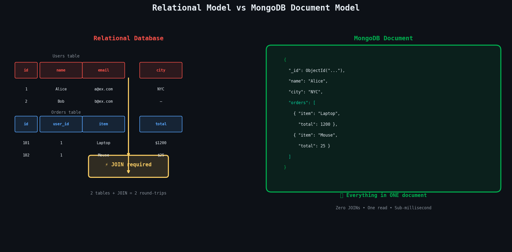
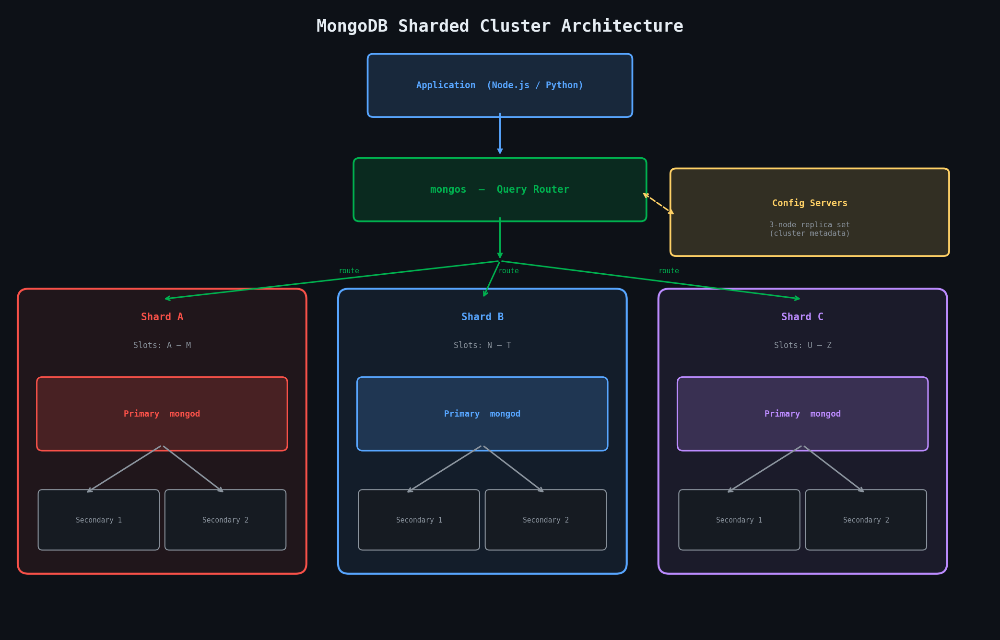
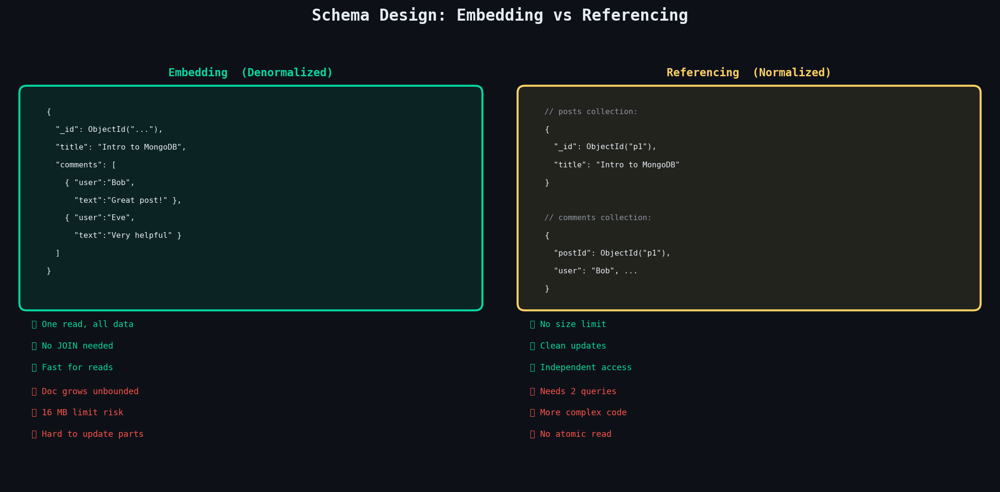
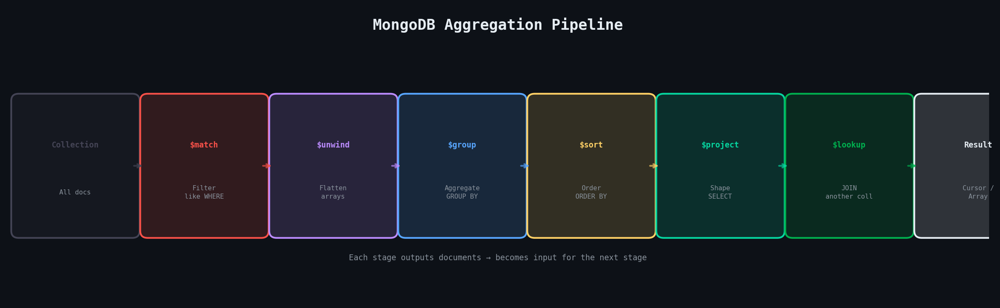
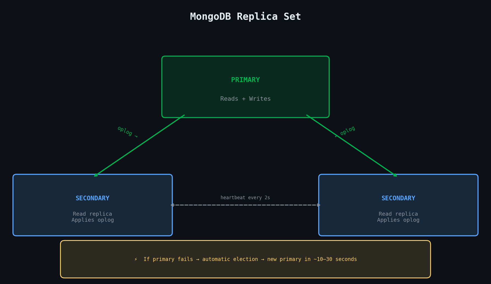
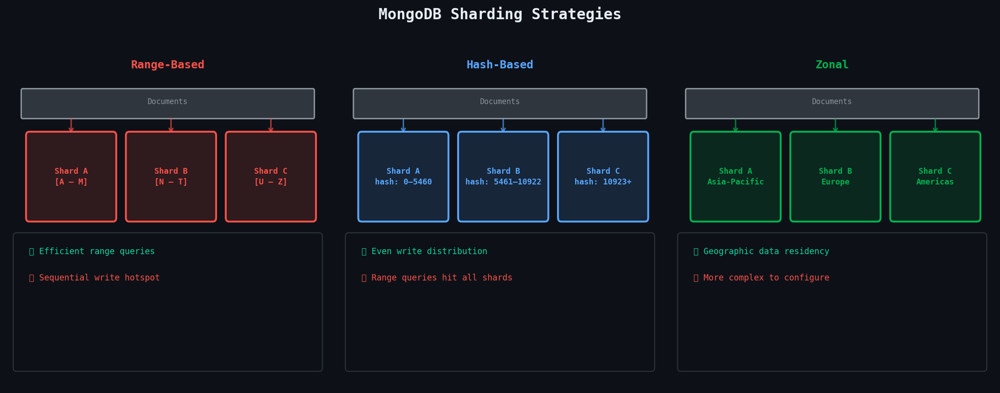

# Unit III: Document Stores - MongoDB
**Complete Student Guide | BE Software Engineering | NoSQL Databases**

> *A first-person guide to document databases, written the way one student explains it to another*

---

## Table of Contents

| # | Topic |
|---|-------|
| 3.1 | [Introduction to Document Databases](#31-introduction-to-document-databases) |
| 3.2 | [MongoDB Architecture](#32-mongodb-architecture) |
| 3.3 | [The Data Model & BSON](#33-the-mongodb-data-model) |
| 3.4 | [CRUD Operations](#34-crud-operations) |
| 3.5 | [Query Language & Aggregation](#35-mongodb-query-language) |
| 3.6 | [Transactions & Consistency](#36-transactions--consistency) |
| 3.7 | [Scaling MongoDB](#37-scaling-mongodb) |
| 3.8 | [Ecosystem & Tools](#38-the-mongodb-ecosystem--tools) |
| ⚡ | [Quick Reference — CRUD at a Glance](#quick-reference--crud-at-a-glance) |

---

## 3.1 Introduction to Document Databases

The best way to understand document databases is to first ask *why* they exist. Relational databases are brilliant — they've powered most of the software world for decades — but they were designed in an era when storage was expensive and schemas were planned carefully upfront. Today, data comes in all shapes and sizes: a product might have five attributes, another might have fifty. Forcing every piece of data into rigid tables with fixed columns starts to feel like trying to organize a messy desk by nailing everything flat.

Document databases solve this by saying: **let the data carry its own structure**. Instead of a row in a table, you store a document — a self-contained JSON-like object that can have nested objects, arrays, and fields that differ from document to document.



### 3.1.1 The Core Characteristics

The **first** defining characteristic is that documents are the fundamental unit of data. Unlike a relational row, a document can contain embedded sub-documents and arrays, letting you represent complex real-world objects naturally. A blog post document can contain the post body, an array of tags, and a nested author object — all in one place, retrieved with one database operation, no joins required.

The **second** is schema flexibility. In MongoDB specifically, collections don't enforce a fixed schema by default. You can add a new field to some documents without migrating the entire collection. This is enormously useful when your data model evolves, which it always does in real projects.

The **third** is that document databases are built for horizontal scaling from the ground up, with sharding and replication baked into their design rather than bolted on afterward.

---

### 3.1.2 Comparing the Three Paradigms

| Dimension | Relational (MySQL) | Key-Value (Redis) | Document (MongoDB) |
|-----------|-------------------|------------------|-------------------|
| **Data format** | Rows in tables | String/value pairs | JSON-like documents |
| **Schema** | Fixed, enforced | None | Flexible, optional |
| **Query power** | Full SQL | Key lookup only | Rich field queries |
| **Nesting / arrays** | Not native (needs JOINs) | Not native | Native, first-class |
| **Best for** | Complex relations, OLTP | Caching, sessions | Catalogs, content, profiles |

A key-value store offers maximum speed but only lets you look up data by its exact key. A document database sits in the sweet spot: you get a flexible, nested data model like key-value, but you can query any field in any document, create indexes, and run complex aggregations — giving you much of the power of relational databases without the rigid schema.

---

### 3.1.3 Where MongoDB Fits Best

The use cases where you reach for MongoDB first are those where data naturally has a **hierarchical or nested structure**:

**Product Catalogs** — Every product has different attributes: a laptop has RAM, storage, battery life; a shirt has size, colour, fabric. In MongoDB, each product is a document with exactly the fields it needs.

**Content Management Systems** — Articles, blog posts, and pages each have rich, varying metadata.

**User Profile Stores** — Profiles that carry embedded data like addresses, preferences, or social links.

**Real-time Analytics & Event Logging** — High-throughput writes with flexible aggregation afterward.

Anywhere the shape of your data varies across records, and anywhere you want to avoid expensive JOINs at query time, MongoDB shines.

---

## 3.2 MongoDB Architecture

Understanding what's actually running when you use MongoDB makes everything else click. At its core, MongoDB is a client-server system — your application connects to a server process that manages storage, indexing, replication, and query execution.



### 3.2.1 Core Components

The heart of MongoDB is a process called **`mongod`** — the MongoDB Daemon. This is the actual database server: it receives queries, reads and writes data to the storage engine, manages indexes, handles replication, and enforces access control. In a simple single-server deployment, this is all you need.

In a sharded cluster, a second process called **`mongos`** enters the picture. The `mongos` is a **query router**. Your application connects to `mongos` instead of directly to any data-holding server. `mongos` receives the query, figures out which shard(s) hold the relevant data, forwards the query, collects the results, and merges them into a single response. From your application's perspective, it looks like you're talking to one database — the sharding is transparent.

The third component is the **config server**. Config servers store all the metadata about the cluster: which shard owns which range of data, what collections are sharded, and where each shard lives. They are deployed as a three-node replica set for redundancy. Every time `mongos` routes a query, it consults the config servers to know where to send the request.

---

### 3.2.2 Storage Engines

The storage engine is the component inside `mongod` responsible for how data is physically stored on disk and read back into memory.

**WiredTiger** (default since MongoDB 3.2) is what you'll use in essentially every production deployment. What makes it stand out is **document-level concurrency control** — it uses MVCC (Multiversion Concurrency Control) to let multiple readers and writers work simultaneously without blocking each other, as long as they're touching different documents. It also supports transparent compression (snappy by default, zlib for higher ratios), which typically cuts your storage footprint by 50–80%. WiredTiger also maintains a write-ahead log (the journal) for crash recovery.

> 💡 **Key Insight:** WiredTiger's document-level locking is a massive improvement over the old MMAPv1 engine that only had collection-level locking. Two simultaneous writes to different documents in the same collection don't block each other at all.

**The In-Memory storage engine** stores all data in RAM and writes nothing to disk. Data is lost on shutdown or crash — deliberately. It exists for workloads where you need the absolute fastest possible reads/writes and the data is ephemeral: session stores, real-time leaderboards, or analytics aggregations you can afford to recompute.

---

### 3.2.3 Replication and Sharding — The Big Picture

MongoDB handles scale through two orthogonal mechanisms:

**Replication** is about durability and availability — it keeps multiple copies of your data on different servers so that if one server dies, the others continue serving reads and writes.

**Sharding** is about capacity and throughput — it splits data across multiple servers so no single machine needs to hold all of it.

These two concepts work together: in a sharded cluster, each shard is itself a replica set, giving you both distribution and redundancy simultaneously.

---

## 3.3 The MongoDB Data Model

Before writing a single query, you need to understand how MongoDB actually structures data. The data model is the foundation that everything else — queries, indexes, performance — is built on top of.

### 3.3.1 BSON — Binary JSON

When you write a MongoDB document, you write it as JSON-like syntax. But internally, MongoDB stores and transmits data in a format called **BSON — Binary JSON**. BSON extends JSON with additional data types that JSON doesn't support, encodes type information explicitly, and is designed for efficient binary traversal rather than human readability.

```javascript
// A BSON document with diverse types
{
  "_id":       ObjectId("64f8a1c3b3a2d1e4f5g6h7i8"), // Auto-generated 12-byte ID
  "name":      "Alice Sharma",                        // String
  "age":       28,                                    // Int32
  "score":     98.6,                                  // Double
  "balance":   Decimal128("1024.50"),                 // High-precision decimal
  "createdAt": ISODate("2024-09-01T10:30:00Z"),       // Date
  "isActive":  true,                                  // Boolean
  "metadata":  null                                   // Null
}
```

**Key BSON types beyond standard JSON:**

| Type | Description |
|------|-------------|
| `ObjectId` | 12-byte identifier — encodes timestamp, machine ID, sequence number. Globally unique and sortable by creation time. |
| `Date` | Milliseconds since Unix epoch as a 64-bit integer — far more efficient than date strings. |
| `Decimal128` | High-precision decimals needed for financial data. |
| `Binary` | Raw bytes for files or cryptographic hashes. |

---

### 3.3.2 Document Structure and Embedded Documents

A MongoDB document is a BSON object with a **maximum size of 16 MB**. Within that limit, you can nest documents as deeply as you want and use arrays of any type, including arrays of embedded documents.

```javascript
// A rich, nested document representing a user
{
  "_id": ObjectId("64f8a1c3b3a2d1e4f5g6h7i8"),
  "name": "Alice Sharma",
  "address": {                            // Embedded sub-document
    "street": "123 Norzin Lam",
    "city":   "Thimphu",
    "country":"Bhutan"
  },
  "skills": ["Python", "MongoDB", "Docker"],  // Array of strings
  "orders": [                             // Array of embedded documents
    { "item": "Laptop", "qty": 1, "price": 1200 },
    { "item": "Mouse",  "qty": 2, "price": 25   }
  ]
}
```

---

### 3.3.3 Collections and Databases

Documents are grouped into **collections**, which are the MongoDB equivalent of tables. Unlike a relational table, a collection doesn't enforce that all documents have the same fields — by default, you can insert any document into any collection.

When you insert the first document into a collection that doesn't exist yet, MongoDB creates it automatically. The same applies to databases — you don't create them explicitly, they come into existence the moment you write data to them.

One database can contain many collections, and one MongoDB server can contain many databases. Typically you use one database per application, organized by entity type: a `users` collection, a `products` collection, an `orders` collection, and so on.

---

### 3.3.4 Schema Design Patterns

This is the part of MongoDB that trips people up most, because they're used to relational normalization rules. In MongoDB, **schema design is driven by access patterns** — how your application reads data — not by eliminating redundancy. The two fundamental choices you face are **embedding versus referencing**.



**The rule:** embed when the related data is always accessed together, when the embedded data is bounded in size, and when the relationship is one-to-one or one-to-few. Reference when the related data can grow to unlimited entries, when the related data is accessed independently of its parent, or when the same sub-document is referenced from many parent documents.

> **The 16 MB Limit:** Every MongoDB document has a hard 16 MB size limit. If you embed an array that can grow without bounds — like comments on a viral post — you will eventually hit this wall. This is the clearest signal that you should use referencing instead of embedding.

---

## 3.4 CRUD Operations

CRUD — Create, Read, Update, Delete — is the foundation of any database interaction. MongoDB's CRUD API is clean and consistent, and once you understand the pattern for one type of operation, the others follow naturally. All examples below assume a `users` collection.

### 3.4.1 Insert Operations

```javascript
// Insert a single document
db.users.insertOne({
  name:  "Alice Sharma",
  email: "alice@example.com",
  age:   28,
  city:  "Thimphu"
});
// Result: { acknowledged: true, insertedId: ObjectId("...") }

// Insert multiple documents in one operation
db.users.insertMany([
  { name: "Bob",   age: 32, city: "Paro"    },
  { name: "Carol", age: 25, city: "Thimphu" },
  { name: "Dave",  age: 40, city: "Punakha" }
], { ordered: false });
// ordered: false → if one fails, the rest still insert
```

> `insertMany` is significantly faster than calling `insertOne` in a loop — it sends all documents in a single network round-trip.

---

### 3.4.2 Read Operations

```javascript
// Find all documents in the collection
db.users.find({});

// Find with a filter
db.users.find({ city: "Thimphu" });

// Projection: include only name and email, exclude _id
db.users.find(
  { city: "Thimphu" },
  { name: 1, email: 1, _id: 0 }
);

// Sort, limit, and skip (pagination)
db.users.find({ age: { $gte: 25 } })
  .sort({ age: 1 })    // 1 = ascending, -1 = descending
  .skip(0)
  .limit(10);

// findOne returns the first match directly (not a cursor)
db.users.findOne({ email: "alice@example.com" });
```

---

### 3.4.3 Update Operations

Updates in MongoDB use **update operators** — special keywords prefixed with `$` that describe what to change. The most important is `$set`, which updates specific fields without touching the rest of the document.

> If you skip the update operator and pass a plain document as the second argument, you're doing a **replacement** — the entire document gets overwritten.

```javascript
// Update one field on one document
db.users.updateOne(
  { email: "alice@example.com" },      // filter
  { $set: { city: "Paro", age: 29 } } // update
);

// Update all matching documents
db.users.updateMany(
  { city: "Thimphu" },
  { $set: { region: "Western" } }
);

// Useful update operators
db.users.updateOne(
  { name: "Alice" },
  {
    $inc:    { age: 1 },              // Increment a numeric field
    $push:   { skills: "Docker" },    // Add to array
    $unset:  { tempField: "" },       // Remove a field
    $rename: { oldName: "newName" }   // Rename a field
  }
);

// Replace the whole document (only _id preserved)
db.users.replaceOne(
  { name: "Dave" },
  { name: "David", city: "Punakha", role: "admin" }
);
```

---

### 3.4.4 Delete Operations

```javascript
// Delete the first matching document
db.users.deleteOne({ email: "test@example.com" });

// Delete all matching documents
db.users.deleteMany({ isActive: false });

// Delete ALL documents in a collection (keep the collection and its indexes)
db.users.deleteMany({});

// Drop the entire collection (collection + indexes + metadata gone)
db.users.drop();
```

> **Safety habit:** Always run a `find` with your filter first to confirm you're targeting the right documents before running the delete.

---

## 3.5 MongoDB Query Language

MongoDB's query language is far richer than simple equality filters. It has a comprehensive set of operators for comparisons, logical expressions, array manipulation, and more. And beyond basic queries, the Aggregation Framework lets you process and transform data in ways that rival SQL's `GROUP BY`, `HAVING`, and window functions.

### 3.5.1 Query Operators

All query operators in MongoDB are prefixed with `$` and are expressed as values inside a query document.

```javascript
// ── Comparison operators ─────────────────────────────────────────────────
db.users.find({ age: { $eq:  28 } });                           // age = 28
db.users.find({ age: { $ne:  28 } });                           // age ≠ 28
db.users.find({ age: { $gt: 25, $lte: 40 } });                  // 25 < age ≤ 40
db.users.find({ city: { $in:  ["Thimphu", "Paro"] } });         // city in list
db.users.find({ city: { $nin: ["Guwahati"] } });                // city NOT in list

// ── Logical operators ────────────────────────────────────────────────────
db.users.find({ $and: [{ age: { $gte: 25 } }, { city: "Thimphu" }] });
db.users.find({ $or:  [{ city: "Thimphu" }, { city: "Paro" }] });
db.users.find({ age:  { $not: { $lt: 18 } } });

// ── Element operators ────────────────────────────────────────────────────
db.users.find({ phone: { $exists: true } });   // only docs that have the field
db.users.find({ age:   { $type: "int" } });    // only if age is an integer

// ── Array operators ──────────────────────────────────────────────────────
db.users.find({ skills: { $all: ["Python", "MongoDB"] } }); // has ALL of these
db.users.find({ skills: { $size: 3 } });                    // array has exactly 3
db.users.find({ orders: { $elemMatch: { price: { $gt: 1000 } } } }); // any element matches

// ── Dot notation to query nested fields ──────────────────────────────────
db.users.find({ "address.city": "Thimphu" });
db.users.find({ "orders.0.item": "Laptop" });   // index into array
```

---

### 3.5.2 The Aggregation Framework

The Aggregation Framework is MongoDB's most powerful feature for data analysis. You build a **pipeline** — a sequence of stages — where each stage transforms the data and passes the result to the next stage.



```javascript
// Count orders per city, only for users aged 25+, sorted by order count
db.users.aggregate([
  { $match:   { age: { $gte: 25 } } },      // Stage 1: filter (like WHERE)
  { $unwind:  "$orders" },                   // Stage 2: flatten orders array
  { $group: {                                // Stage 3: group and aggregate
      _id:          "$city",
      totalOrders:  { $sum: 1 },
      totalRevenue: { $sum: "$orders.price" },
      avgRevenue:   { $avg: "$orders.price" }
  }},
  { $sort:    { totalOrders: -1 } },         // Stage 4: descending
  { $limit:   5 },                           // Stage 5: top 5 only
  { $project: {                              // Stage 6: reshape output
      city:         "$_id",
      totalOrders:  1,
      totalRevenue: { $round: ["$totalRevenue", 2] },
      _id:          0
  }},
  { $lookup: {                               // Stage 7: JOIN with another collection
      from:         "regions",
      localField:   "city",
      foreignField: "cityName",
      as:           "regionInfo"
  }}
]);
```

---

### 3.5.3 Text Search and Geospatial Queries

```javascript
// Create a text index covering multiple fields
db.products.createIndex({ name: "text", description: "text" });

// Search for documents containing "noise cancelling"
db.products.find(
  { $text: { $search: "noise cancelling" } },
  { score: { $meta: "textScore" } }          // include relevance score
).sort({ score: { $meta: "textScore" } });   // sort by relevance

// Geospatial: create a 2dsphere index, then query by proximity
db.restaurants.createIndex({ location: "2dsphere" });
db.restaurants.find({
  location: {
    $near: {
      $geometry:    { type: "Point", coordinates: [89.6419, 27.4712] },
      $maxDistance: 5000   // 5 km in metres
    }
  }
});
```

---

### 3.5.4 Indexes and Query Optimization

Without indexes, MongoDB scans every document in a collection to find matches — a **COLLSCAN** (collection scan). As collections grow, this becomes catastrophically slow. Indexes are pre-sorted data structures that let MongoDB jump directly to relevant documents.

```javascript
// Single-field index (ascending)
db.users.createIndex({ email: 1 }, { unique: true });

// Compound index (ESR order: Equality first, Sort/Range after)
db.orders.createIndex({ status: 1, createdAt: -1 });

// Multikey index: automatically created when field holds an array
db.users.createIndex({ skills: 1 });   // indexes each element of skills array

// TTL index: auto-delete documents after a time period
db.sessions.createIndex({ createdAt: 1 }, { expireAfterSeconds: 3600 });

// EXPLAIN: see how MongoDB executes a query
db.users.find({ city: "Thimphu" }).explain("executionStats");
// Look for: winningPlan.stage = "IXSCAN" (good), not "COLLSCAN" (bad)

// List all indexes on a collection
db.users.getIndexes();

// Drop an index
db.users.dropIndex({ email: 1 });
```

> **How to Read EXPLAIN:** When you run `explain("executionStats")`, `stage` should be `IXSCAN` (using an index), not `COLLSCAN` (full scan). The field `totalDocsExamined` should be close to `nReturned` — a huge gap means your index isn't selective enough.

**The ESR Rule for compound indexes:** put **E**quality fields first, **S**ort fields second, **R**ange fields last.

---

## 3.6 Transactions & Consistency

For a long time, the knock on MongoDB was that it didn't support multi-document transactions. MongoDB 4.0 (2018) changed that by introducing full ACID multi-document transactions, bringing MongoDB in line with relational databases on this critical dimension.

### 3.6.1 Multi-Document ACID Transactions

ACID stands for **A**tomicity, **C**onsistency, **I**solation, and **D**urability — the classic guarantees of a reliable transaction system. A MongoDB multi-document transaction groups multiple operations together so that either all of them succeed or none of them take effect.

```javascript
// Transfer credits between two users atomically
const session = client.startSession();

try {
  session.startTransaction({
    readConcern:  { level: "snapshot" },
    writeConcern: { w: "majority" }
  });

  await db.accounts.updateOne(
    { userId: "alice" },
    { $inc: { balance: -100 } },
    { session }
  );
  await db.accounts.updateOne(
    { userId: "bob" },
    { $inc: { balance: +100 } },
    { session }
  );

  await session.commitTransaction();   // Both writes visible atomically

} catch (err) {
  await session.abortTransaction();    // Neither write takes effect

} finally {
  session.endSession();
}
```

> **Use Transactions Sparingly:** Multi-document transactions carry performance overhead — they hold locks, require coordination across nodes, and can cause contention. If you find yourself reaching for transactions often, it's a sign you should reconsider your schema design. Embedding related data that changes together eliminates the need for transactions entirely in most cases.

---

### 3.6.2 Read and Write Concerns

Read and write concerns let you tune the **consistency-performance trade-off** for individual operations or transactions.

| Write Concern | Meaning | Durability |
|--------------|---------|------------|
| `w: 0` | Fire and forget, no acknowledgement | None |
| `w: 1` | Primary acknowledged (default) | Low — lost on primary crash |
| `w: "majority"` | Most replica members acknowledged | High — survives primary crash |
| `j: true` | Flushed to on-disk journal | Highest — survives power loss |

**Read concern** controls which version of data a read operation sees. `local` returns the most recent data on the queried node (may not be replicated yet). `majority` returns only data confirmed by most nodes — stronger consistency, slightly more latency. `linearizable` provides the strongest guarantee but applies only to single-document reads.

---

### 3.6.3 Consistency in Distributed Environments

In a distributed system, you can't have perfect consistency and perfect availability simultaneously (the **CAP theorem**). MongoDB defaults to strong consistency for the primary, and eventual consistency for reads from secondaries.

If you read from a secondary (`readPreference: "secondary"`), you might see slightly stale data because replication is asynchronous. This is usually acceptable for read-heavy workloads like dashboards. But for anything where freshness is critical — showing a user their own recent changes — you should read from the primary or use a read concern of `majority`.

---

## 3.7 Scaling MongoDB

One of MongoDB's strongest selling points is that it was designed to scale horizontally from the beginning. You can start with a single server and grow to a globally distributed cluster without changing your application code.

### 3.7.1 Replication and Replica Sets

A **replica set** is a group of MongoDB servers that all hold the same data. One node is the **Primary** — it receives all writes. The remaining nodes are **Secondaries** — they replicate the primary's operations log (the **oplog**) and apply the same writes to their own copy of the data.

If the primary fails, the secondaries hold an election and promote one of themselves to become the new primary, usually within **10–30 seconds**.



Replica sets need an odd number of vote-holding members to avoid split-brain scenarios. In a three-member set, any two members form a quorum. If you want to add a fourth server but don't want to pay for a full data-holding replica, you can add an **Arbiter** — a lightweight process that votes in elections but stores no data.

---

### 3.7.2 Sharding Strategies and Shard Keys

Sharding distributes data across multiple replica sets (called shards). The most critical decision in a sharded cluster is choosing the **shard key** — the field MongoDB uses to decide which shard owns each document. Get this wrong and you'll end up with hotspot shards that handle most of the traffic while others sit idle.



| Strategy | How It Works | Good For | Watch Out For |
|----------|-------------|----------|---------------|
| **Range** | Contiguous value ranges per shard | Range queries, ordered data | Hotspot on sequential writes |
| **Hash** | Hash of shard key → uniform distribution | Write-heavy, even distribution | Inefficient range queries |
| **Zonal** | Pin data ranges to specific zones | Geographic data residency | More complex to configure |

---

### 3.7.3 Horizontal Scaling and Load Balancing

The beauty of MongoDB's sharding architecture is that scaling horizontally is operationally simple. When a shard becomes too full or too hot, you add a new shard. MongoDB's **balancer process** — which runs on the config servers — automatically migrates chunks (ranges of data) from overloaded shards to the new one in the background, without any downtime and without changing application code.

For read-heavy workloads, you can also add more secondaries to each shard's replica set, which your application can read from using `readPreference: "secondaryPreferred"`.

> 🌍 **Real World — MongoDB Atlas at Scale:** Companies like Amadeus (airline reservations) and Verizon run MongoDB clusters with hundreds of shards spanning billions of documents. MongoDB Atlas handles the entire lifecycle — adding shards, migrating chunks, index building — behind a managed UI.

---

## 3.8 The MongoDB Ecosystem & Tools

MongoDB the database is powerful, but the surrounding ecosystem of tools makes it truly production-ready.

### 3.8.1 MongoDB Atlas — The Cloud-Native Choice

Atlas is MongoDB's fully-managed cloud database service, available on AWS, Azure, and GCP. Instead of provisioning servers, installing MongoDB, configuring replica sets, setting up backups, and managing upgrades yourself, you click a few buttons in the Atlas UI and get a production-grade cluster in minutes.

Atlas handles replication, automated backups with point-in-time recovery, monitoring with intelligent alerts, performance advisor (it suggests indexes for slow queries), encryption at rest and in transit, and auto-scaling.

What's most impressive about Atlas is its **global distribution features**. You can create a global cluster that spans multiple cloud regions, and Atlas will automatically route reads to the nearest region for low latency while keeping writes consistent.

---

### 3.8.2 MongoDB Compass — See Your Data Visually

Compass is MongoDB's official desktop GUI. It connects to any MongoDB deployment (local or Atlas) and gives you a visual interface for:

- Exploring collections and documents
- Running and building queries
- Building aggregation pipelines with drag-and-drop stages
- Analyzing document schemas
- Managing indexes
- Viewing query execution plans

The embedded aggregation pipeline builder is particularly useful when you're building complex multi-stage pipelines and want to see the output of each stage interactively.

---

### 3.8.3 Mongoose — Structure for Node.js

MongoDB itself is schemaless, which is great for flexibility but can become chaotic in a team environment. **Mongoose** is an ODM (Object Data Modeler) for Node.js that adds a schema layer on top of MongoDB. With Mongoose, you define the shape of your documents in code, and it enforces that shape when you save data — providing type casting, validation, query helpers, and middleware hooks.

```javascript
const mongoose = require('mongoose');

// Define a schema
const userSchema = new mongoose.Schema({
  name:     { type: String,  required: true, trim: true },
  email:    { type: String,  required: true, unique: true, lowercase: true },
  age:      { type: Number,  min: 0, max: 150 },
  skills:   [String],
  address:  {
    city:    String,
    country: { type: String, default: "Bhutan" }
  },
  createdAt: { type: Date, default: Date.now }
});

// Add a method to the schema
userSchema.methods.greet = function() {
  return `Hello, I'm ${this.name}`;
};

// Compile the model from the schema
const User = mongoose.model('User', userSchema);

// Use it like any class
const alice = new User({ name: 'Alice', email: 'alice@example.com', age: 28 });
await alice.save();

// Query with Mongoose's chainable API
const users = await User.find({ age: { $gte: 25 } })
  .select('name email')
  .sort('-createdAt')
  .limit(10);
```

---

### 3.8.4 MongoDB Charts and BI Connector

**MongoDB Charts** is a visualization tool built directly into Atlas. You connect it to a collection and build dashboards — bar charts, line charts, maps, scatter plots — without writing any aggregation queries yourself. Particularly useful for stakeholder-facing dashboards where your business team wants to see data without a developer writing a new report each time.

The **MongoDB BI Connector** acts as a MySQL-compatible layer in front of MongoDB, translating SQL queries from BI tools like Tableau, Power BI, or Looker into MongoDB aggregation pipelines. Your analytics team can keep using the SQL tools they already know while the engineering team uses MongoDB on the backend — no friction, no migration required.

---

## Quick Reference — CRUD at a Glance

| Operation | MongoDB Command | SQL Equivalent |
|-----------|----------------|----------------|
| Insert one | `db.col.insertOne({ ... })` | `INSERT INTO col VALUES (...)` |
| Insert many | `db.col.insertMany([...])` | `INSERT INTO col VALUES (...),(...)` |
| Read all | `db.col.find({})` | `SELECT * FROM col` |
| Read filtered | `db.col.find({ age: { $gt: 25 } })` | `SELECT * FROM col WHERE age > 25` |
| Read one | `db.col.findOne({ email: ... })` | `SELECT * FROM col WHERE email=... LIMIT 1` |
| Update fields | `db.col.updateOne({filter}, { $set: {...} })` | `UPDATE col SET ... WHERE ...` |
| Update all matches | `db.col.updateMany({filter}, {...})` | `UPDATE col SET ... WHERE ...` |
| Delete one | `db.col.deleteOne({filter})` | `DELETE FROM col WHERE ... LIMIT 1` |
| Delete many | `db.col.deleteMany({filter})` | `DELETE FROM col WHERE ...` |
| Aggregate | `db.col.aggregate([...])` | `SELECT ... GROUP BY ... ORDER BY ...` |

---

## Principles to Carry Forward

| Principle | The Rule |
|-----------|----------|
| **Schema design** | Design for access patterns, not for normalization |
| **Embedding** | Embed when data is always read together and is bounded in size |
| **Referencing** | Reference when data grows unboundedly or is shared across documents |
| **Indexing** | Every field you query or sort on needs an index in production |
| **EXPLAIN first** | Always check the execution plan before deploying a query to production |
| **Aggregation** | Process data inside MongoDB, not in your application layer |
| **Transactions** | Use sparingly — frequent transaction use often signals a schema design issue |
| **Write concern** | Use `w: majority` for any data that matters |
| **Sharding** | Choose shard key carefully — a bad choice is extremely hard to change later |
| **Right tool** | MongoDB excels at flexible, hierarchical data — don't force it to be a relational DB |

---

*Guide prepared for  NoSQL Databases | Unit III: Document Stores (MongoDB)***
