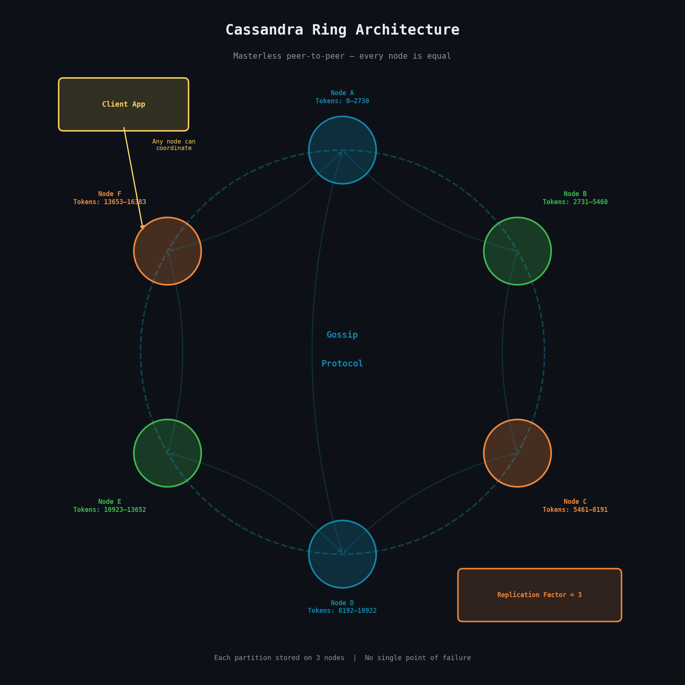
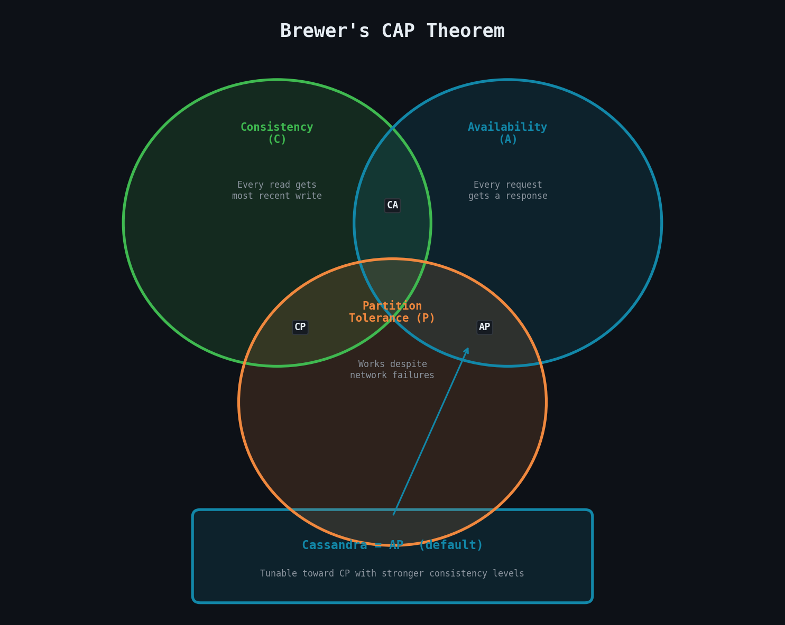
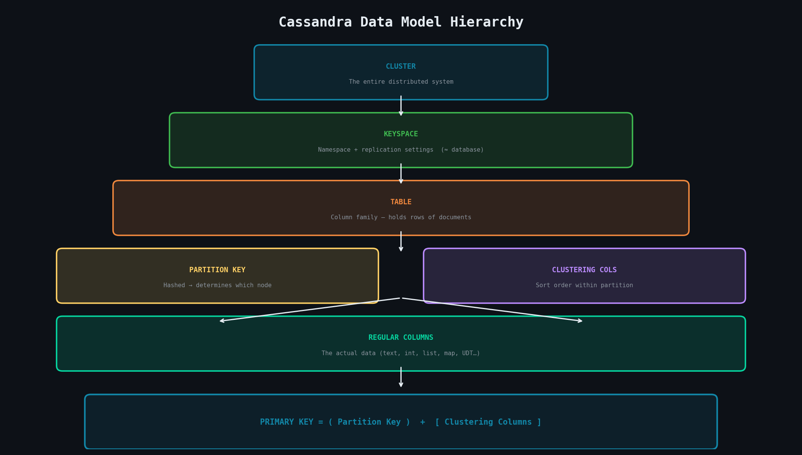
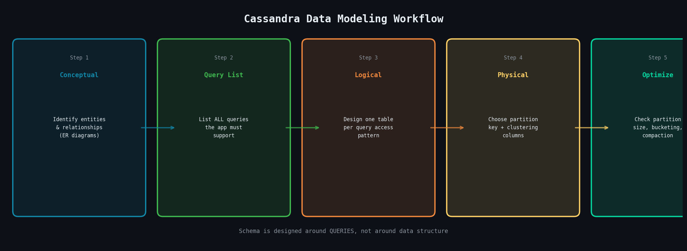
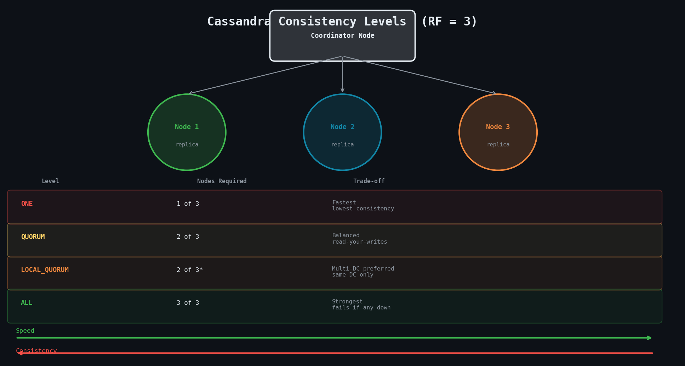
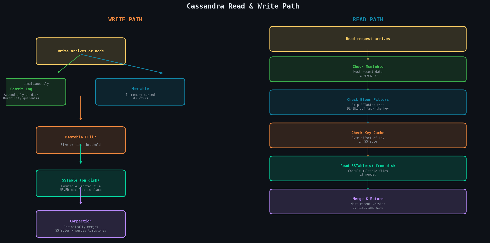
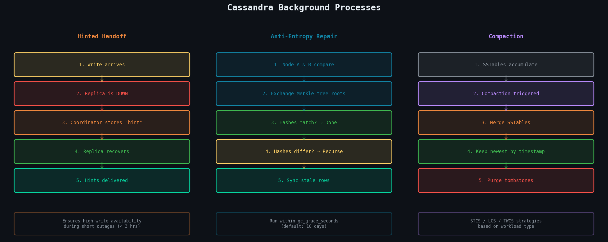

# Unit IV: Column Family Stores - Apache Cassandra
**Comprehensive Study Notes | NoSQL Databases | Distributed Systems**

---

## Table of Contents

| # | Topic |
|---|-------|
| 4.1 | [Introduction to Apache Cassandra](#41-introduction-to-apache-cassandra) |
| 4.2 | [Architecture and Data Model](#42-cassandra-architecture-and-data-model) |
| 4.3 | [Installation and Configuration](#43-installing-and-configuring-cassandra) |
| 4.4 | [Data Modeling in Cassandra](#44-data-modeling-in-cassandra) |
| 4.5 | [Advanced Cassandra Concepts](#45-advanced-cassandra-concepts) |

---

## 4.1 Introduction to Apache Cassandra

### 4.1.1 The Cassandra Elevator Pitch

#### Cassandra in 50 Words or Less

Apache Cassandra is an open-source, distributed NoSQL database designed to handle massive amounts of structured data across many commodity servers **without any single point of failure**. It offers high availability, linear scalability, and tunable consistency, making it one of the most battle-tested systems for internet-scale applications.

> In essence: Cassandra gives you a database that **never goes down**, grows as fast as your business, and can be stretched across multiple datacenters around the globe — all without a central master node.

---

#### Distributed and Decentralized Architecture

Unlike traditional relational databases that rely on a single master node to coordinate reads and writes, Cassandra follows a **masterless, peer-to-peer model**. Every node in a Cassandra cluster is functionally equal and can serve both read and write requests. There is no single coordinator or central registry, which means there is no single point of failure.

This decentralized architecture makes Cassandra exceptionally robust against hardware failures and network partitions. Data is automatically distributed across nodes using a **consistent hashing mechanism**, and every node holds a portion of the total data.



---

#### Elastic Scalability and High Performance

Cassandra is built for **horizontal scalability**. When the workload grows, you simply add more nodes to the cluster, and Cassandra automatically redistributes the data across the new and existing nodes — a process called **rebalancing**. This can be done with **zero downtime** and without any complex manual resharding.

Because writes are written to multiple nodes simultaneously using an in-memory structure before being flushed to disk, write throughput is extremely high. Cassandra is designed to handle **hundreds of thousands of write operations per second** on commodity hardware.

---

#### High Availability and Fault Tolerance

Cassandra replicates data to multiple nodes automatically, based on a configurable **replication factor**. If the replication factor is set to three, every piece of data is stored on three different nodes. If one or even two of those nodes fail, the data is still fully accessible from the surviving node.

This means Cassandra can tolerate hardware failures, network outages, and even **entire datacenter failures** without losing data or going offline — making it an industry favourite for applications that require **99.999% uptime**.

---

#### Tuneable Consistency

Cassandra allows developers to choose the level of consistency they require on a **per-operation basis**:

| Setting | Behaviour |
|---------|-----------|
| Single node acknowledgement | Maximum speed and availability |
| Quorum of nodes | Balanced (most common) |
| All replicas must confirm | Maximum data consistency |

This flexibility, known as **tuneable consistency**, lets developers make the right trade-off between speed and correctness for their specific use case.

---

### 4.1.2 Theoretical Foundations

#### Brewer's CAP Theorem

CAP Theorem (proposed by Eric Brewer in 2000) states that any distributed data store can guarantee **at most two** of the following three properties simultaneously:



| Property | Description |
|----------|-------------|
| **C**onsistency | Every read receives the most recent write or an error |
| **A**vailability | Every request receives a non-error response |
| **P**artition Tolerance | The system continues to operate even if messages are dropped between nodes |

Since network partitions are an inevitable reality in distributed systems, a practical system must always be partition-tolerant, meaning the real choice is between **consistency and availability**.

Cassandra is traditionally classified as an **AP system** — it prioritises Availability and Partition Tolerance. When a partition occurs, Cassandra continues to accept reads and writes but may return slightly stale data. However, because Cassandra offers tuneable consistency, it can be configured to behave more like a **CP system** by requiring stronger consistency guarantees.

---

#### Row-Oriented Data Model

Cassandra uses a **column-family data model** that is superficially similar to a relational table but behaves very differently. Data is organised into rows identified by a unique **partition key**. Each row can contain a very large number of columns, and different rows in the same table can have different columns.

This sparse, wide-row model is well-suited for:
- Time-series data
- Event logs
- Workloads where each entity has a potentially different set of attributes

Unlike a relational database, Cassandra does not support ad-hoc queries via joins — the schema is designed around the specific queries the application needs to make.

---

### 4.1.3 Cassandra's Origins and Evolution

Cassandra was originally developed at **Facebook** to power its Inbox Search feature, which needed to handle enormous write volumes and serve results with very low latency. The project was open-sourced in 2008 and donated to the **Apache Software Foundation** in 2009.

The design of Cassandra drew heavily from two influential papers:

| Paper | Year | Contribution |
|-------|------|-------------|
| Amazon's **Dynamo** paper | 2007 | Consistent hashing, vector clocks, eventual consistency |
| Google's **Bigtable** paper | 2006 | Column-family data model, SSTable storage format |

**Key milestones in Cassandra's evolution:**

- **v0.8 (2011)** — Cassandra Query Language (CQL) replaced the complex Thrift API with SQL-like syntax
- **v1.2** — Virtual nodes (vnodes) introduced
- **v4.0** — Lightweight transactions, materialised views, zero-downtime upgrades
- **v5.x** — Improved performance, observability, and Paxos consensus upgrades

---

### 4.1.4 Use Cases and Applications

#### Large Deployments

| Company | Usage |
|---------|-------|
| **Apple** | Thousands of nodes, petabytes of data |
| **Netflix** | Viewing history, ratings, session state for 100M+ users |
| **Instagram** | User feeds and social graph |
| **Uber** | Trip and driver data |
| **Discord** | Millions of messages per second |

#### Write-Heavy Workloads and Analytics

Because Cassandra's write path is extremely optimised — using an in-memory write structure followed by sequential disk writes — it is an excellent choice for:

- IoT sensor data ingestion
- Clickstream logging
- Financial transaction recording
- Time-series metrics storage
- Analytical pipelines requiring high write throughput

#### Geographical Distribution

Cassandra has **native support for multi-datacenter replication**. Data can be configured to be replicated across geographically distant datacenters, allowing applications to serve users from the nearest datacenter with low latency. This is called **geo-distribution**, and it also provides a natural disaster recovery strategy — if one entire datacenter goes offline, the others continue serving traffic seamlessly.

#### Hybrid Cloud and Multicloud Deployment

Cassandra's datacenter-aware architecture allows nodes across AWS, GCP, Azure, and on-premises hardware to be part of the **same logical cluster**. Replication can be configured separately for each datacenter, making it straightforward to build hybrid and multicloud data strategies that avoid vendor lock-in.

---

## 4.2 Cassandra Architecture and Data Model

### 4.2.1 Cassandra's Distributed Architecture

#### Data Centers and Racks

In Cassandra's terminology:

```
CLUSTER  (entire distributed system)
  └── DATACENTER  (physical/logical grouping — e.g. AWS us-east-1)
        └── RACK  (physical server rack or cloud fault domain)
              └── NODE  (individual Cassandra server)
```

Cassandra uses **rack awareness** to ensure replicas are spread across different racks, reducing the risk of multiple replicas being lost due to a single rack failure.

---

#### Rings and Tokens

Cassandra organises its nodes logically in a **ring structure**. Each node is assigned one or more **tokens** that define its position on the ring and determine the range of data it is responsible for.

When a client writes data, the partition key of the row is hashed using a **partitioner** to produce a token value. This token value determines which node or nodes are responsible for storing that row. The node whose token range covers the computed token becomes the **coordinator** and routes the write to the appropriate replica nodes.

The ring model ensures that data is distributed evenly across the cluster. As nodes join or leave the ring, tokens are reassigned so that load remains balanced.

---

#### Virtual Nodes (vnodes)

In early versions of Cassandra, each physical node was assigned exactly one token — adding or removing nodes required careful manual calculation. **Virtual nodes (vnodes)**, introduced in Cassandra 1.2, solved this by assigning each physical node **many small token ranges** rather than one large one.

```
Default: each node owns 256 virtual nodes spread across the ring
```

| Old (Single Token) | New (vnodes) |
|-------------------|-------------|
| Manual token calculation needed | Automatic distribution |
| Imbalanced after node changes | Always balanced |
| Slow rebalancing | Parallelised, faster |
| 1 token range per node | 256 ranges per node |

Vnodes have become the **standard configuration** in modern Cassandra deployments.

---

### 4.2.2 Core Components

#### Gossip Protocol and Failure Detection

Cassandra nodes need to know the state of every other node without having a central coordinator. They achieve this through a **gossip protocol**:

```
Every second:
  Each node → gossips with up to 3 random nodes
  Shares: own state + accumulated knowledge of other nodes
  Result:  full cluster state known in O(log N) rounds
```

Failure detection uses the **Phi Accrual Failure Detector**. Rather than a binary alive/dead judgment, this algorithm produces a continuous **suspicion level (phi)** that increases the longer a node has been unresponsive. When phi exceeds a configurable threshold, the node is considered down. This approach adjusts to network conditions automatically.

---

#### Snitches and Partitioners

A **snitch** determines the topology of the cluster — specifically, which datacenter and rack each node belongs to.

| Snitch | Use Case |
|--------|----------|
| `SimpleSnitch` | Single-datacenter development clusters |
| `GossipingPropertyFileSnitch` | Production multi-datacenter clusters |
| `Ec2Snitch` | AWS-specific deployments |

A **partitioner** determines how the partition key is hashed to produce a token.

| Partitioner | Status | Notes |
|------------|--------|-------|
| `Murmur3Partitioner` | Default/Recommended | MurmurHash3 — very uniform distribution |
| `RandomPartitioner` | Deprecated | Uses MD5 |
| `ByteOrderedPartitioner` | Discouraged | Creates hotspots |

---

#### Replication Strategies

Replication is configured at the **keyspace level**.

| Strategy | Use Case |
|----------|----------|
| `SimpleStrategy` | Single-datacenter deployments only |
| `NetworkTopologyStrategy` | All production deployments, especially multi-datacenter |

```sql
-- Production multi-datacenter keyspace
CREATE KEYSPACE my_app
  WITH replication = {
    'class': 'NetworkTopologyStrategy',
    'dc1': 3,
    'dc2': 2   -- 3 replicas in dc1, 2 in dc2 for DR
  };
```

`NetworkTopologyStrategy` allows specifying a **different replication factor per datacenter** and places replicas across different racks within each datacenter.

---

### 4.2.3 Cassandra's Data Model



#### Clusters and Keyspaces

```
CLUSTER
  └── KEYSPACE  (≈ database/schema)
        ├── Replication settings
        └── TABLE (column family)
              ├── Partition Key  → determines which node
              ├── Clustering Columns → sort order within partition
              └── Regular Columns → the actual data
```

#### Tables and Columns

The **primary key** in Cassandra is more complex than in relational databases:

```
PRIMARY KEY = Partition Key + Clustering Columns
```

| Component | Role |
|-----------|------|
| **Partition Key** | Determines which node stores the row (via hashing) |
| **Clustering Columns** | Determine sort order of rows within a partition |
| Together | Uniquely identify a row |

> All rows with the same partition key are stored together on the same node and retrieved in a **single disk read** — making it very efficient to query all rows within a partition.

---

#### CQL Data Types

**Simple Types:**

```sql
text, int, bigint, float, double, boolean,
uuid, timeuuid, timestamp, blob, inet, decimal
```

| Type | Special Use |
|------|------------|
| `uuid` | Universally unique identifier |
| `timeuuid` | Version-1 UUID with embedded timestamp — great for time-ordered unique keys |
| `decimal` | High-precision numbers for financial data |

**Collection Types:**

```sql
-- List: ordered sequence
skills list<text>

-- Set: unordered, unique values
tags set<text>

-- Map: key-value pairs
preferences map<text, text>
```

**User-Defined Types (UDTs):**

```sql
CREATE TYPE address (
  street  text,
  city    text,
  postal  text
);

-- Use as a column type
CREATE TABLE users (
  user_id uuid PRIMARY KEY,
  home_address frozen<address>
);
```

---

## 4.3 Installing and Configuring Cassandra

### 4.3.1 Installation Methods

| Method | Best For |
|--------|----------|
| **Apache binary tarball** | Production Linux servers (recommended) |
| **apt package manager** | Debian/Ubuntu — handles dependencies & service registration |
| **Build from source** | Contributors, custom patches, experimental features |
| **Docker** | Development, testing, CI/CD pipelines |

#### Docker Quick Start (Development)

```bash
# Single node
docker run --name cassandra -d cassandra:latest

# Connect cqlsh
docker exec -it cassandra cqlsh

# Multi-node with Docker Compose
docker compose up -d
```

> ⚠️ Docker deployments are **not recommended for production** due to containerisation performance overhead.

---

### 4.3.2 Basic Server Operations

#### Starting and Stopping

```bash
# Start in foreground (useful for dev — shows logs)
bin/cassandra -f

# Start as background daemon
bin/cassandra

# With systemd (apt-installed)
systemctl start   cassandra
systemctl stop    cassandra
systemctl status  cassandra
```

#### nodetool — Primary Management CLI

```bash
nodetool status   # State of all nodes (load, token ranges, up/down)
nodetool info     # Information about the local node
nodetool ring     # Token ring and data distribution
nodetool repair   # Trigger anti-entropy repair
nodetool compact  # Trigger manual compaction
nodetool flush    # Flush memtables to SSTables
```

---

### 4.3.3 Configuration: cassandra.yaml

Key parameters in the primary configuration file:

```yaml
cluster_name: 'MyCluster'          # All nodes in same cluster must match
listen_address: 192.168.1.10       # IP for node-to-node communication
native_transport_port: 9042        # CQL client connection port (default)
seeds: "192.168.1.10,192.168.1.11" # Bootstrap nodes for new joiners
data_file_directories:
  - /var/lib/cassandra/data        # Where SSTables are stored
commitlog_directory: /var/lib/cassandra/commitlog
endpoint_snitch: GossipingPropertyFileSnitch
```

> 💡 **Heap Sizing:** Set Java heap to **no more than 8 GB** even if the server has much more RAM. Larger Java heaps cause long GC pauses. The remaining memory is used by the OS page cache, which Cassandra uses extensively for SSTable caching.

---

### 4.3.4 CQL Shell (cqlsh)

```bash
# Connect to localhost (default port 9042)
cqlsh

# Connect to remote node
cqlsh 192.168.1.10 9042
```

#### Essential cqlsh Commands

```sql
-- Schema inspection
DESCRIBE KEYSPACES;
DESCRIBE TABLES;
DESCRIBE TABLE user_events;

-- Navigation
USE my_keyspace;

-- Run a script file
SOURCE '/path/to/script.cql';

EXIT;
```

#### Creating Keyspaces and Tables

```sql
-- Development (single node)
CREATE KEYSPACE my_app
  WITH replication = {'class': 'SimpleStrategy', 'replication_factor': 1};

-- Production (multi-datacenter)
CREATE KEYSPACE my_app
  WITH replication = {
    'class': 'NetworkTopologyStrategy',
    'dc1': 3, 'dc2': 2
  };

-- Table with partition key + clustering column
CREATE TABLE user_events (
  user_id    uuid,
  event_time timestamp,
  event_type text,
  payload    text,
  PRIMARY KEY (user_id, event_time)
) WITH CLUSTERING ORDER BY (event_time DESC);
-- user_id = partition key | event_time = clustering column (newest first)
```

#### Writing and Reading Data

```sql
-- INSERT (upsert — no existence check)
INSERT INTO user_events (user_id, event_time, event_type, payload)
VALUES (uuid(), toTimestamp(now()), 'click', '{"button":"submit"}');

-- UPDATE (also an upsert)
UPDATE user_events
  SET payload = '{"button":"cancel"}'
  WHERE user_id = ? AND event_time = ?;

-- SELECT — must filter by partition key
SELECT * FROM user_events WHERE user_id = ?;

-- Range on clustering column (efficient — sorted on disk)
SELECT * FROM user_events
  WHERE user_id = ?
    AND event_time > '2024-01-01'
  LIMIT 100;

-- ALLOW FILTERING — forces full cluster scan (dangerous on large data!)
SELECT * FROM user_events WHERE event_type = 'click' ALLOW FILTERING;
```

---

## 4.4 Data Modeling in Cassandra



### 4.4.1 Conceptual Data Modeling

Conceptual modeling in Cassandra begins the same way as any database: understanding the business domain and identifying entities and their relationships using **Entity-Relationship (ER) diagrams**.

Entities: `User`, `Product`, `Order`, `Event` — and how they relate: a User places many Orders, an Order contains many Products, and so on.

> At this stage, you are NOT yet concerned with physical storage or specific queries. The goal is a complete, technology-agnostic model of the business domain.

---

### 4.4.2 Logical Data Modeling

#### Differences from RDBMS Design

| RDBMS | Cassandra |
|-------|-----------|
| Normalize data to eliminate redundancy | **Denormalize** — duplicate data across tables |
| JOIN multiple tables at read time | **Pre-join** data at write time |
| Design around data structure | **Design around queries** |
| One table per entity | Multiple tables per access pattern |

Cassandra does not support JOINs. If you need data from two entities in a single query, you must pre-join that data at write time and store it together in a single table. **Denormalization is not a compromise — it is the required approach.**

---

#### Query-Driven Modeling Approach

The cornerstone of Cassandra data modeling:

```
Step 1: Identify ALL queries your application must support
Step 2: For each query, design a table whose partition key
        and clustering columns exactly support that query
```

**Example — Orders by User AND by Date:**

```sql
-- Query 1: Get all orders for a given user
CREATE TABLE orders_by_user (
  user_id    uuid,
  order_date date,
  order_id   uuid,
  total      decimal,
  PRIMARY KEY (user_id, order_date)
) WITH CLUSTERING ORDER BY (order_date DESC);

-- Query 2: Get all orders placed on a given date
CREATE TABLE orders_by_date (
  order_date date,
  order_id   uuid,
  user_id    uuid,
  total      decimal,
  PRIMARY KEY (order_date, order_id)
);

-- Every new order is written to BOTH tables
-- Write-time duplication = read-time performance
```

---

### 4.4.3 Physical Data Modeling

#### Partition Design

The choice of **partition key** is the most critical decision in Cassandra data modeling. A good partition key must:

1. Provide **even distribution** of data across the cluster
2. Allow queries to be satisfied by reading a **single partition**

| Problem | Cause | Fix |
|---------|-------|-----|
| **Hotspot** | Partition key too coarse (e.g. `date` puts all day's data on one node) | Add more granularity |
| **Scatter-gather** | Partition key too fine (queries span many partitions) | Combine related data |

**Composite Partition Key** — when a single column doesn't provide adequate distribution:

```sql
-- (region, user_id) distributes first by region, then by user
PRIMARY KEY ((region, user_id), event_time)
--            ^^^^^^^^^^^^^^^^  composite partition key
```

---

#### Clustering Columns

Clustering columns determine the **sort order of rows within a partition**. They are stored in sorted order on disk, making range queries extremely efficient.

```sql
-- Retrieve last 100 events for a user ordered by time
CREATE TABLE user_events (
  user_id         uuid,
  event_timestamp timestamp,   -- clustering column
  event_type      text,
  PRIMARY KEY (user_id, event_timestamp)
) WITH CLUSTERING ORDER BY (event_timestamp DESC);

-- Cassandra reads the first 100 rows directly — no full scan needed
SELECT * FROM user_events WHERE user_id = ? LIMIT 100;
```

> ⚠️ The `ORDER BY` clause in a SELECT can **only** reorder results in the direction defined by the clustering columns — it cannot sort by arbitrary columns. This is why choosing the right clustering column order at schema design time is critical.

**Multiple clustering columns** — each subsequent column is sorted within groups defined by the preceding one:

```sql
PRIMARY KEY (user_id, year, month, day)
-- Sorted: user_id → year → month → day
```

---

### 4.4.4 Schema Optimization Techniques

#### Calculating Partition Size

Cassandra recommends keeping individual partitions **below 100 MB** (10 MB is a practical guideline for good performance).

```
Partition Size = (number of rows in partition) × (average row size)

Example:
  1,000,000 events/year × 200 bytes/event = 200 MB  ← TOO LARGE
```

#### Breaking Up Large Partitions — Bucketing

The standard technique is **bucketing** — add a time or range component to the partition key:

```sql
-- Bad: one partition per user (can grow forever)
PRIMARY KEY (user_id, event_time)

-- Good: one partition per user per month
PRIMARY KEY ((user_id, year_month), event_time)

-- Application queries across buckets when needed:
SELECT * FROM events WHERE user_id = ? AND year_month = '2024-01';
SELECT * FROM events WHERE user_id = ? AND year_month = '2024-02';
```

The trade-off: more complex application logic in exchange for manageable partition sizes.

---

### 4.4.5 Data Modeling Tools

| Tool | Type | Description |
|------|------|-------------|
| **Hackolade** | Commercial GUI | Visual schema modeling, generates CQL DDL |
| **Chebotko Diagrams** | Notation standard | Tables with K (partition key) and C (clustering column) markers |
| **DataStax Studio** | IDE/Notebook | Interactive notebooks for exploring and documenting schemas |

---

## 4.5 Advanced Cassandra Concepts

### 4.5.1 Consistency Models

#### Consistency Levels

Cassandra's tuneable consistency is implemented through **consistency levels** specified per operation by the client.



| Level | Replicas Required | Speed | Consistency |
|-------|-----------------|-------|-------------|
| `ONE` | 1 replica responds | Fastest | Weakest — may return stale data |
| `QUORUM` | Majority (RF/2 + 1) | Balanced | Strong — read-your-writes guaranteed |
| `LOCAL_QUORUM` | Majority within local DC | Fast (no cross-DC) | Strong within DC |
| `ALL` | Every replica | Slowest | Strongest — fails if any replica down |

> 💡 **The QUORUM guarantee:** When both reads AND writes use `QUORUM`, you are guaranteed to read the most recently written data because at least one node must have participated in both operations.

With `replication_factor = 3`: QUORUM = `floor(3/2) + 1 = 2` nodes

---

#### Lightweight Transactions and Paxos

Standard Cassandra writes are **blind upserts** — they don't check current state before writing. **Lightweight Transactions (LWTs)** add compare-and-set semantics using the **Paxos distributed consensus protocol**.

```sql
-- Insert ONLY if row doesn't already exist
INSERT INTO users (id, name, email)
VALUES (123, 'Alice', 'alice@example.com')
IF NOT EXISTS;

-- Update ONLY if current value matches condition
UPDATE accounts
  SET balance = 900
  WHERE user_id = 123
IF balance = 1000;
```

> ⚠️ **LWTs are expensive** — they require multiple round trips between nodes for Paxos consensus. Use sparingly and only where strictly necessary (e.g. user registration, payment idempotency).

---

### 4.5.2 Read and Write Path



#### Write Path

When a write arrives at a node, **two things happen simultaneously**:

```
Write arrives
    │
    ├──► Commit Log (append-only, on disk)
    │    └── Ensures durability — replayed on crash recovery
    │
    └──► Memtable (in-memory sorted structure)
         └── When full → flushed to disk as SSTable
```

#### The SSTable

An **SSTable (Sorted Strings Table)** is an immutable, sorted file on disk. Immutability is a critical design choice:

- Cassandra **never modifies** an existing SSTable in place
- Updates and deletes are written as **new entries** with newer timestamps
- Multiple versions are reconciled during **compaction**
- Over time, many SSTables accumulate → reads may need to consult multiple files

#### Read Path

```
Read request
    │
    ├── Check Memtable (in-memory, most recent)
    │
    ├── Check Bloom Filters (skip SSTables that don't have the key)
    │
    ├── Check Key Cache (byte offset of partition in SSTable)
    │
    └── Read SSTable(s) from disk
         └── Merge results → return most recent version by timestamp
```

#### Bloom Filters and Caching

A **Bloom filter** is a probabilistic data structure that:
- Definitively says when a row is **NOT** in an SSTable (no false negatives)
- Usually (not always) says when it **IS** present (occasional false positives)

Before reading any SSTable, Cassandra checks its Bloom filter — if absent, the SSTable is skipped entirely, **dramatically reducing unnecessary disk I/O**.

| Cache | What It Stores | Benefit |
|-------|---------------|---------|
| **Key cache** | Byte offset of recently accessed partition keys in SSTables | Direct seek — no secondary index lookup |
| **Row cache** | Entire rows in memory | Eliminates disk I/O for hot rows entirely |

---

### 4.5.3 Background Processes



#### Hinted Handoff

Hinted handoff handles **temporary node failures** during write operations:

```
Write arrives → Replica node is DOWN
    │
    └── Coordinator stores a "hint" locally
        (a small record: "deliver this write to Node X when it recovers")
        │
        └── Node X recovers → Coordinator sends all accumulated hints
```

> ⚠️ Hints are stored only for a configurable window of time (**default: 3 hours**). Very long outages may result in hints being discarded — requiring a manual repair.

---

#### Anti-Entropy and Repair

Over time, replica nodes can drift out of sync due to node failures, network partitions, or expired hints. The **repair process** brings replicas back into sync using **Merkle trees**:

```
Node A & Node B compare data:
    │
    ├── Exchange the top hash of their Merkle trees
    │    If hashes match → subtrees are identical → done
    │    If hashes differ → recurse into subtrees
    │
    └── Identify specific rows that differ
         → Send most recent version (by timestamp) to the stale node
```

> 💡 **Operational requirement:** Run repair on every node within the `gc_grace_seconds` interval (default **10 days**) to prevent deleted data from being resurrected from out-of-date replicas.

```bash
# Run repair on a specific keyspace
nodetool repair my_keyspace

# Run repair on entire node
nodetool repair
```

---

#### Compaction

Because Cassandra writes immutable SSTables, a table will accumulate many SSTables over time — some containing updated versions or **tombstones** (deletion markers). **Compaction** periodically merges multiple SSTables into one consolidated SSTable.

During compaction, Cassandra:
- Resolves version conflicts — keeps only the most recent version by timestamp
- Permanently purges tombstones older than `gc_grace_seconds`

**Compaction Strategies:**

| Strategy | Workload | How It Works |
|----------|----------|-------------|
| **STCS** (Size-Tiered) | Write-heavy *(default)* | Groups SSTables of similar sizes and merges them |
| **LCS** (Leveled) | Read-heavy | Keeps SSTables in size-limited levels — each row exists in at most 1 SSTable per level |
| **TWCS** (Time Window) | Time-series data | Groups SSTables by time window — old windows compact and drop together with TTLs |

```sql
-- Set compaction strategy at table creation
CREATE TABLE sensor_data (
  sensor_id uuid,
  recorded_at timestamp,
  value double,
  PRIMARY KEY (sensor_id, recorded_at)
) WITH CLUSTERING ORDER BY (recorded_at DESC)
  AND compaction = {
    'class': 'TimeWindowCompactionStrategy',
    'compaction_window_unit': 'DAYS',
    'compaction_window_size': 1
  };
```

---

### 4.5.4 System Management

#### Internal Managers and Services

| Component | Responsibility |
|-----------|---------------|
| **StorageService** | Ring participation, token assignment, bootstrapping |
| **StorageProxy** | Routes client requests to replica nodes, enforces consistency levels |
| **Gossiper** | Peer-to-peer gossip protocol, cluster membership |
| **CommitLogService** | Writing to and reading from the commit log |
| **MemtableFlushWriter** | Flushing Memtables to disk as SSTables |
| **CompactionManager** | Scheduling and executing background compaction |
| **HintedHandoffManager** | Tracking and delivering hints to recovered nodes |
| **AntiEntropyService** | Repair process — Merkle tree comparison and sync |

---

#### System Keyspaces

Cassandra stores its own metadata in special internal keyspaces:

| Keyspace | Contains |
|----------|----------|
| `system` | Local node info — token ranges, schema version, gossip state |
| `system_schema` | Complete schema of all user keyspaces, tables, types, functions |
| `system_distributed` | Distributed metadata for repair and views |
| `system_traces` | Query tracing data (when tracing is enabled) |

```sql
-- Introspection examples
SELECT * FROM system.local;                 -- Info about local node
SELECT * FROM system_schema.tables;         -- All tables in cluster
SELECT * FROM system_schema.keyspaces;      -- All keyspaces

-- Enable query tracing
TRACING ON;
SELECT * FROM my_table WHERE id = ?;
TRACING OFF;
```

> ⚠️ **Never manually modify data in system keyspaces** — doing so can corrupt the cluster's state.

---

## Quick Reference Cheat Sheet

### CQL Commands Summary

```sql
-- ── KEYSPACE ──────────────────────────────────────────────────────────────
CREATE KEYSPACE ks WITH replication = {'class': 'NetworkTopologyStrategy', 'dc1': 3};
DROP KEYSPACE ks;
USE ks;

-- ── TABLES ────────────────────────────────────────────────────────────────
CREATE TABLE events (
  user_id    uuid,
  event_time timestamp,
  payload    text,
  PRIMARY KEY (user_id, event_time)
) WITH CLUSTERING ORDER BY (event_time DESC);

ALTER TABLE events ADD new_col text;
DROP TABLE events;

-- ── CRUD ──────────────────────────────────────────────────────────────────
INSERT INTO events (user_id, event_time, payload) VALUES (?, ?, ?);
INSERT INTO events (user_id, event_time, payload) VALUES (?, ?, ?) IF NOT EXISTS;

SELECT * FROM events WHERE user_id = ?;
SELECT * FROM events WHERE user_id = ? AND event_time > ? LIMIT 100;

UPDATE events SET payload = ? WHERE user_id = ? AND event_time = ?;
UPDATE events SET payload = ? WHERE user_id = ? AND event_time = ? IF EXISTS;

DELETE FROM events WHERE user_id = ? AND event_time = ?;
DELETE FROM events WHERE user_id = ?;   -- deletes entire partition

-- ── TTL ───────────────────────────────────────────────────────────────────
INSERT INTO sessions (id, data) VALUES (?, ?) USING TTL 3600;  -- expires in 1 hour

-- ── INDEXES ───────────────────────────────────────────────────────────────
CREATE INDEX ON events (event_type);    -- secondary index (use sparingly)

-- ── CONSISTENCY ───────────────────────────────────────────────────────────
CONSISTENCY QUORUM;       -- set for this session
CONSISTENCY LOCAL_QUORUM; -- preferred for multi-DC
```

### Key Principles Summary

| Principle | Rule |
|-----------|------|
| **Query-first design** | Design tables around queries, not data structure |
| **Denormalize** | Duplicate data across tables — it is expected and required |
| **Partition key** | Must distribute evenly AND satisfy your primary query |
| **Partition size** | Keep below 100 MB; aim for under 10 MB |
| **Clustering columns** | Define sort order at schema time — you can't sort arbitrarily later |
| **No ALLOW FILTERING** | Never use in production on large datasets — full cluster scan |
| **Consistency** | Use `QUORUM` or `LOCAL_QUORUM` for strong consistency |
| **LWTs** | Use sparingly — Paxos is expensive |
| **Run repair** | Regularly, within every `gc_grace_seconds` (10 days default) |
| **Compaction strategy** | Match to your workload: STCS (writes), LCS (reads), TWCS (time-series) |

---

*Notes prepared for **NoSQL Databases | Distributed Systems | Unit IV: Column Family Stores (Apache Cassandra)***
